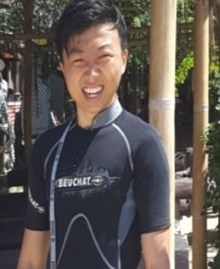
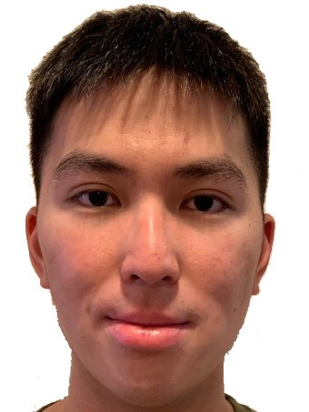
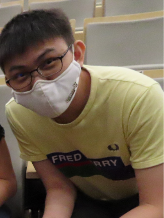
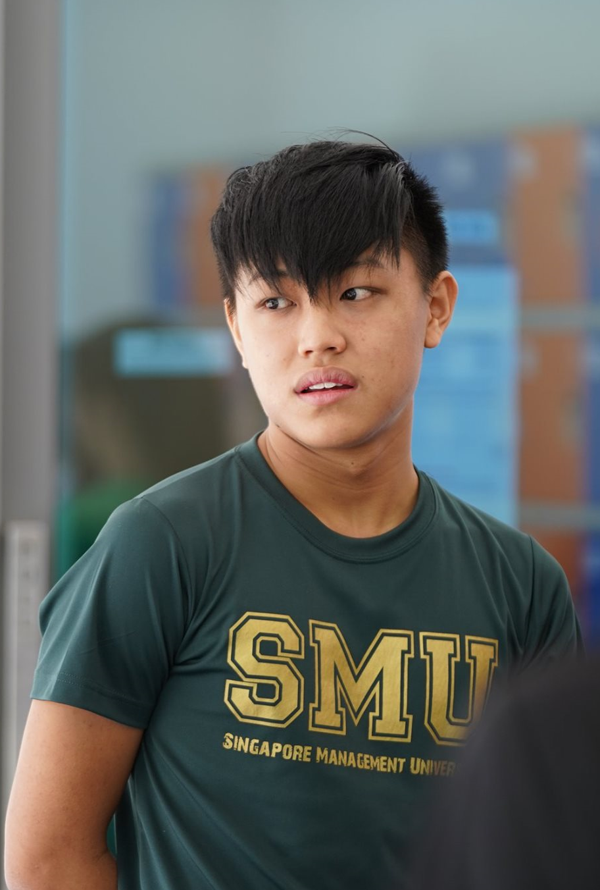
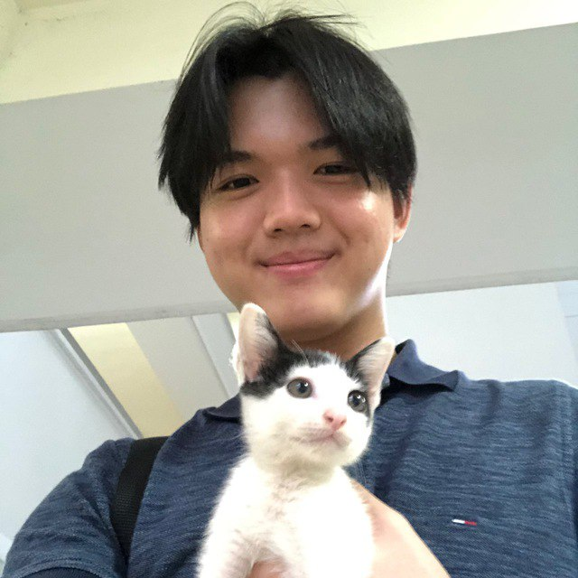

We are a team based in the [School of Computing, National University of Singapore](http://www.comp.nus.edu.sg).

You can reach us at the email `seer[at]comp.nus.edu.sg`

## Project team

### Gary Yansen

[[github](https://github.com/g4ryy)]
[[portfolio](team/johndoe.md)]

* Role: Developer

### Clive Ong

[[github](http://github.com/cliveong)]
[[portfolio](team/johndoe.md)]

* Role: Developer
* Responsibilities: Filter

### Yip Jung Hon

[[github](https://github.com/junghon3709)]
[[portfolio](team/johndoe.md)]

* Role: Developer
* Responsibilities: Data

### Ng Yong Chuan

[[github](http://github.com/random689)]
[[portfolio](team/johndoe.md)]

* Role: Developer
* Responsibilities: Data

### Nigel Tan

[[github](http://github.com/nniiggeell)]
[[portfolio](team/johndoe.md)]

* Role: Developer
* Responsibilities: UI
