* Table of Contents
{:toc}

--------------------------------------------------------------------------------------------------------------------

## **Acknowledgements**

* Libraries used: [JavaFX](https://openjfx.io/), [Jackson](https://github.com/FasterXML/jackson), [JUnit5](https://github.com/junit-team/junit5)

--------------------------------------------------------------------------------------------------------------------

## **Setting up, getting started**

Refer to the guide [_Setting up and getting started_](SettingUp.md).

--------------------------------------------------------------------------------------------------------------------

## **Design**

:bulb: **Tip:** The `.puml` files used to create diagrams in this document can be found in the [diagrams](https://github.com/se-edu/addressbook-level3/tree/master/docs/diagrams/) folder. Refer to the [_PlantUML Tutorial_ at se-edu/guides](https://se-education.org/guides/tutorials/plantUml.html) to learn how to create and edit diagrams.

### Architecture

The ***Architecture Diagram*** given above explains the high-level design of the App.

Given below is a quick overview of main components and how they interact with each other.

**Main components of the architecture**

**`Main`** has two classes called [`Main`](https://github.com/se-edu/addressbook-level3/tree/master/src/main/java/seedu/address/Main.java) and [`MainApp`](https://github.com/se-edu/addressbook-level3/tree/master/src/main/java/seedu/address/MainApp.java). It is responsible for,
* At app launch: Initializes the components in the correct sequence, and connects them up with each other.
* At shut down: Shuts down the components and invokes cleanup methods where necessary.

[**`Commons`**](#common-classes) represents a collection of classes used by multiple other components.

The rest of the App consists of four components.

* [**`UI`**](#ui-component): The UI of the App.
* [**`Logic`**](#logic-component): The command executor.
* [**`Model`**](#model-component): Holds the data of the App in memory.
* [**`Storage`**](#storage-component): Reads data from, and writes data to, the hard disk.

**How the architecture components interact with each other**

The *Sequence Diagram* below shows how the components interact with each other for the scenario where the user issues the command `deleteStudent 1`.

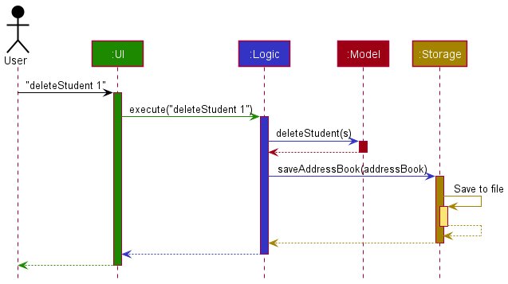

Each of the four main components (also shown in the diagram above),

* defines its *API* in an `interface` with the same name as the Component.
* implements its functionality using a concrete `{Component Name}Manager` class (which follows the corresponding API `interface` mentioned in the previous point.

For example, the `Logic` component defines its API in the `Logic.java` interface and implements its functionality using the `LogicManager.java` class which follows the `Logic` interface. Other components interact with a given component through its interface rather than the concrete class (reason: to prevent outside component's being coupled to the implementation of a component), as illustrated in the (partial) class diagram below.

The sections below give more details of each component.

### UI component

The **API** of this component is specified in [`Ui.java`](https://github.com/se-edu/addressbook-level3/tree/master/src/main/java/seedu/address/ui/Ui.java)

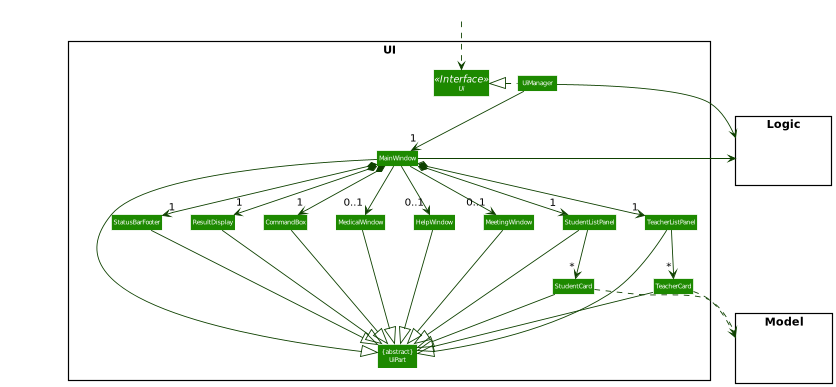

The UI consists of a `MainWindow` that is made up of parts e.g.`CommandBox`, `ResultDisplay`, `StudentListPanel`, `TeacherListPanel`, `StatusBarFooter` etc. All these, including the `MainWindow`, inherit from the abstract `UiPart` class which captures the commonalities between classes that represent parts of the visible GUI.

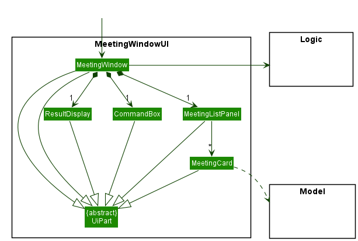

The `MeetingWindow` in `MainWindow` is made up of parts as well e.g. `CommandBox`, `ResultDisplay`, `MeetingListPanel`. Which also inherit from abstract `UiPart` similar to the MainWindow

The `UI` component uses the JavaFx UI framework. The layout of these UI parts are defined in matching `.fxml` files that are in the `src/main/resources/view` folder. For example, the layout of the [`MainWindow`](https://github.com/se-edu/addressbook-level3/tree/master/src/main/java/seedu/address/ui/MainWindow.java) is specified in [`MainWindow.fxml`](https://github.com/se-edu/addressbook-level3/tree/master/src/main/resources/view/MainWindow.fxml)

The `UI` component,

* executes user commands using the `Logic` component.
* listens for changes to `Model` data so that the UI can be updated with the modified data.
* keeps a reference to the `Logic` component, because the `UI` relies on the `Logic` to execute commands.
* depends on some classes in the `Model` component, as it displays `Student` and `Teacher` object residing in the `Model`.

### Logic component

**API** : [`Logic.java`](https://github.com/se-edu/addressbook-level3/tree/master/src/main/java/seedu/address/logic/Logic.java)

Here's a (partial) class diagram of the `Logic` component:

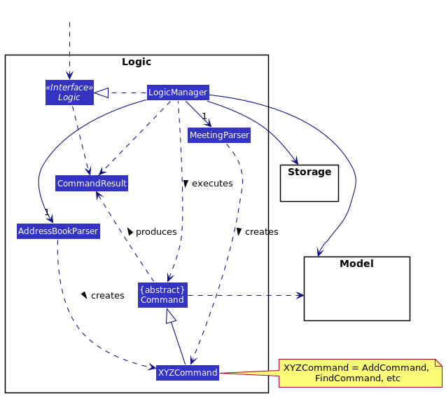

How the `Logic` component works:
1. When `Logic` is called upon to execute a command, it determines which window is the user is on, and uses either the `MeetingParser` or `AddressBookParser` class to parse the user command. It uses `MeetingParser` if the user is executing the command from the meeting window, and `AddressBookParser` if the user is executing the command from the main window.
1. This results in a `Command` object (more precisely, an object of one of its subclasses e.g., `AddCommand`) which is executed by the `LogicManager`.
1. The command can communicate with the `Model` when it is executed (e.g. to add a student).
1. The result of the command execution is encapsulated as a `CommandResult` object which is returned back from `Logic`.

The Sequence Diagram below illustrates the interactions within the `Logic` component for the `execute("deleteStudent 1")` API call.

:information_source: 
**Note:** When the user calls a valid command 
from the `Meeting` window, the interaction within the `Logic` component only has 1 key difference: `LogicManager` 
calls the `MeetingParser#parseCommand`. The rest of the implementation is similar to the diagram below.

:information_source: **Note:** The lifeline for `DeleteStudentCommandParser` should end at the destroy marker (X) but due to a limitation of PlantUML, the lifeline reaches the end of the diagram.

Here are the other classes in `Logic` (omitted from the class diagram above) that are used for parsing a user command:

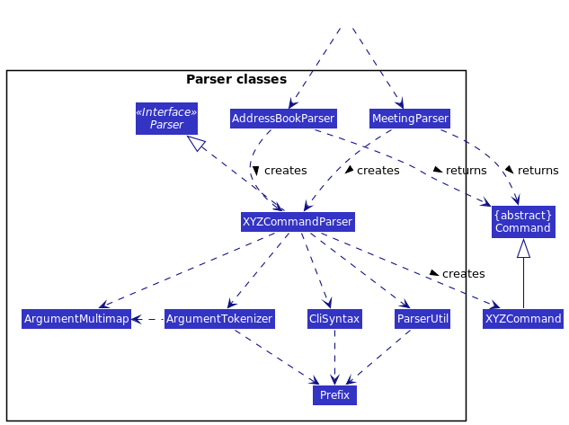

How the parsing works (we describe only for `AddressBookParser`, the one for `MeetingParser` is similar):
* When called upon to parse a user command, the `AddressBookParser` class creates an `XYZCommandParser` (`XYZ` is a placeholder for the specific command name e.g., `AddCommandParser`) which uses the other classes shown above to parse the user command and create a `XYZCommand` object (e.g., `AddCommand`) which the `AddressBookParser` returns back as a `Command` object.
* All `XYZCommandParser` classes (e.g., `AddCommandParser`, `DeleteCommandParser`, ...) inherit from the `Parser` interface so that they can be treated similarly where possible e.g, during testing.

### Model component
**API** : [`Model.java`](https://github.com/se-edu/addressbook-level3/tree/master/src/main/java/seedu/address/model/Model.java)

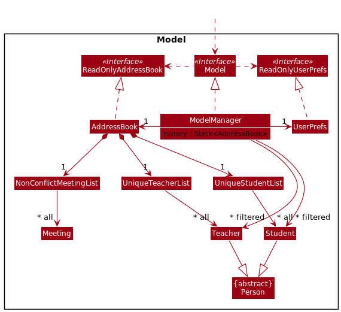

The `Model` component,

* stores the address book data i.e., all `Student`, `Teacher` and `Meeting` objects, which are contained in three separate `UniqueStudentList`, `UniqueTeacherList` and `NonConflictMeetingList` lists respectively.
* stores the currently 'selected' `Student` and `Teacher` objects (e.g., results of a search query) as separate _filtered_ lists which is exposed to outsiders as an unmodifiable `ObservableList<Student>` and `ObservableList<Teacher>` respectively. It can be 'observed' e.g. the UI can be bound to this list so that the UI automatically updates when the data in the list change.
* a stack, `history`, to  keep track of address book histories. This is to facilitate the `undo` command.
* stores a `UserPref` object that represents the user’s preferences. This is exposed to the outside as a `ReadOnlyUserPref` objects.
* does not depend on any of the other three components (as the `Model` represents data entities of the domain, they should make sense on their own without depending on other components)
* As there is no feature to search meetings, there is no need to store a filtered meeting list.

### Storage component

**API** : [`Storage.java`](https://github.com/se-edu/addressbook-level3/tree/master/src/main/java/seedu/address/storage/Storage.java)

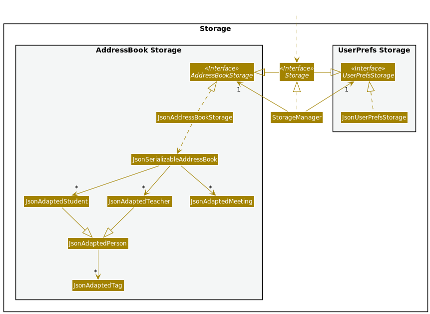

The `Storage` component,
* can save both address book data and user preference data in json format, and read them back into corresponding objects.
* inherits from both `AddressBookStorage` and `UserPrefStorage`, which means it can be treated as either one (if only the functionality of only one is needed).
* depends on some classes in the `Model` component (because the `Storage` component's job is to save/retrieve objects that belong to the `Model`)

### Common classes

Classes used by multiple components are in the `seedu.addressbook.commons` package.

--------------------------------------------------------------------------------------------------------------------

## **Implementation**

This section describes some noteworthy details on how certain features are implemented.

### Undo feature

#### Implementation details

The undo mechanism is facilitated by a stack inside `ModelManager`. Every time the address book updates, a copy of the address book is made and pushed on the stack. As such, `ModelManager` exposes the `undo()` method to pop a previous version of an address book from the stack and reload its contents.

:information_source: 
  **Note:** It is needed for one to store a **copy** of the address book, otherwise any modifications to the existing address book would also alter the copies in the stack.

Given below is an example usage scenario and how the undo mechanism behaves at each step.

Step 1. The user launches the application for the first time. The app creates an address book with the initial address book state, and a copy of this address book, `ab0`, will be pushed into the stack.

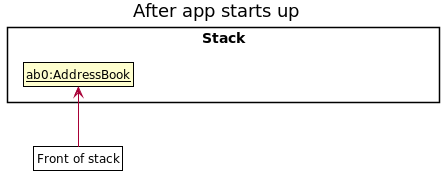

Step 2. The user executes `deleteStudent 1` command to delete the 1st student in the address book. The `deleteStudent` command calls `ModelManager#deleteStudent`, which deletes the student from the existing address book, and then pushes a copy of the modified address book, `ab1`, onto the stack.

Step 3. The user executes `student n/David …​` to add a new student. This command calls command also calls `ModelManager#addStudent`, causing another copy of the modified address book, `ab2`, to be pushed onto the stack.

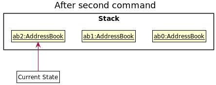

:information_source: 
  **Note:** If a command fails its execution, a new address book will not be pushed onto the stack.

Step 4. The user now decides that adding the person was a mistake, and decides to undo that action by executing the `undo` command. The `undo` command will call `ModelManager#undo`, which will pop the front element from the stack and restore `ab2`'s contents. The top of the stack is now `ab1`.

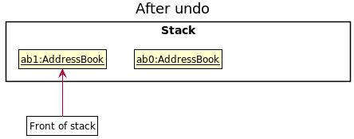

:information_source: 
  **Note:** If the stack has size 1, it means that copy of the address book inside the stack is the same as when the app first started. In this case, the app does not execute the `undo` operation, but rather tells the user that they are already at the oldest change.

The following sequence diagram shows how the undo operation works:

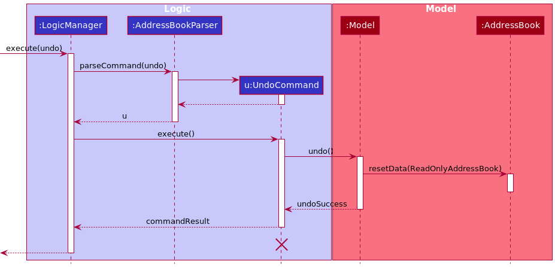

:information_source: 
**Note:** The lifeline for `UndoCommand` should end at the destroy marker (X) but due to a limitation of PlantUML, the lifeline reaches the end of the diagram.

:information_source: 
**Note:** In the event the user executes `undo` from the meeting window, `MeetingParser` will be used instead. 

The `undoSuccess` variable in the above diagram is a `boolean`. It is `true` if the undo is a success, `false` otherwise. The undo command could fail if the app is already at the oldest change (ie. the stack size is 1). `undoSuccess` then determines what the `commandResult` will be. 

#### Design considerations

**Aspect: How `undo` executes:**

* **Alternative 1 (current choice):** Saves the entire address book.
  * Pros: Easy to implement.
  * Cons: May have performance issues in terms of memory usage.

* **Alternative 2:** Individual command knows how to undo/redo by
  itself. For instance, have an `UndoDeleteStudent` command, `UndoEditTeacher` command etc...
  * Pros: Will use less memory (e.g. for `deleteStudent`, just save the person being deleted).
  * Cons: We must ensure that the implementation of each individual command is correct.

We chose Alternative 1 because of the limited timespan of our problem. Also, given that modern computers have large memory, it will not be a problem to store multiple copies of address books if the address book size is not too large.

**Aspect: Behaviour of `undo` across the main window and meeting window:**

* **Alternative 1 (current choice):** We have a single `undo` command, and executing the command undoes the last action by the user.
  * Pros: Easy to implement.
  * Cons: May be confusing to the user to execute the `undo` command in one window and the change being reflected in another window.

* **Alternative 2:** We have two separate commands: `undo` and `undoMeeting`, such that `undo` undoes the last action by the user in the main window while `undoMeeting` undoes the last action by the user in the meeting window.
  * Pros: It is less confusing for the user (as now if the `undo/undoMeeting` command is executed in a particular window, the change will be reflected in the same window).
  * Cons: Harder to implement.

We eventually settled on Alternative 1 because our current implementation of the `AddressBook` class stores all the student, teacher and meeting lists together, and because we are using a stack to manage previous versions of our address book, it is more convient to push the entire address book onto the stack rather than creating a separate class to store meetings.

### Copy Command

#### Implementation details
The `CopyStudentCommand/CopyTeacherCommand` classes extends the `Command` class with the ability to copy a selected field either from a list of students or a list of teachers. This is done via the method `CopyStudentCommand#getCopyContent` (similarly for teachers). This command works on the last shown list to the user, which means the user could filter the student list and copy the subset of students filtered. This works similarly for teachers as well. 

As such, this command is supported by the method in the `Model` interface, namely the `Model#getFilteredStudentList()` and `Model#getFilteredTeacherList()` methods.

Given below is an example usage scenario and how the copy mechanism behaves.

Step 1. The user launches the application for the first time. The current `filteredStudentList` and `filteredTeacherList`
will be initialized with all the students and teachers respectively from the loaded book data.

Step 2. The user executes `copyStudent c/name` to copy all the names of the students that are currently shown in the GUI. The `copyStudent` command calls `Model#getFilteredStudentList`, loading the current list of filtered students, which in this case is all the students from the loaded book data. Afterwards, the `copyStudent` command calls its own `getCopyContent` method, which then calls `CopyCommand#getNameContent` since the user wants to copy all names of students,
appending all the names of the students in the filtered student list to the user's clipboard.

The following sequence diagram shows how the copy operation works for a copyStudent command. The `copyTeacher` command works similarly, so we will only discuss students here. If the user specifies another field to be copied, such as `phone` or `email`, the command also works similarly, so we will not discuss them here.

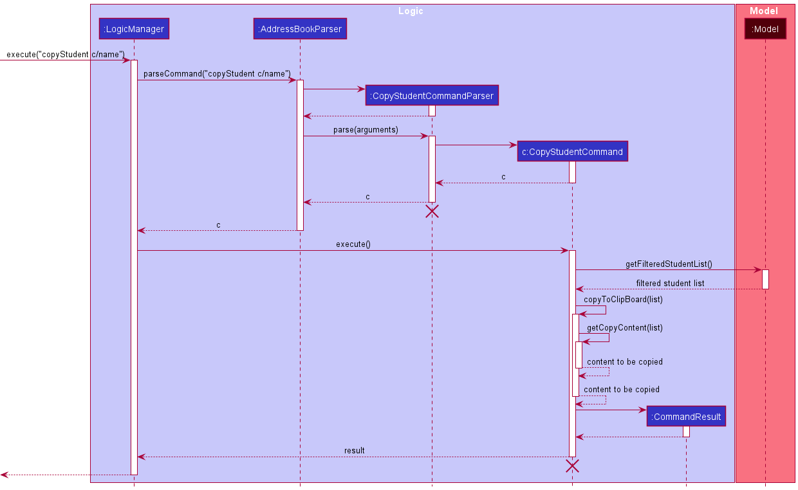

:information_source: 
  **Note:** The lifeline for `CopyStudentCommandParser` and `CopyStudentCommand` should end at the destroy marker (X) but due to a limitation of PlantUML, the lifeline reaches the end of the diagram.

:information_source: 
**Note:** The `copyStudent/copyTeacher` command does not copy anything to the clipboard if the last shown list is empty.

#### Design considerations

**Aspect: Functionality of copy command:**

* **Alternative 1 (current choice):** `copyStudent/copyTeacher` only allows the user to copy a subset of fields (ie. phone, email, name), and the fields that can be copied are the same for both students and teachers.
    * Pros: Easy to implement.
    * Pros: It is easier for the user to remember which fields can be copied. For example, in our implementation, users simply have to remember that only the phone, email and name fields can be copied, for both teachers and students.
    * Cons: Users will not be able to copy other fields.

* **Alternative 2:** `copyStudent/copyTeacher` allows the user to copy any field they like.
    * Pros: The user has more flexibility in which fields they want to copy.
    * Cons: The user has to precisely remember which fields a student or teacher has. For example, the user would have to remember that he/she can copy down the office table numbers for teachers, but not for students. Similarly, he/she would have to remember that the emergency contact number of students can be copied, but not for teachers.

We went with Alternative 1 because we felt that other than a person's phone, email and name, there are very little use cases which would lead one to need to copy down another field. For example, unless it is for a very specific purpose, it is unlikely that the user would need to copy down office table numbers.

### Adding meetings

#### Implementation Details
The mechanism of adding meetings is showcased in the sequence diagram below:

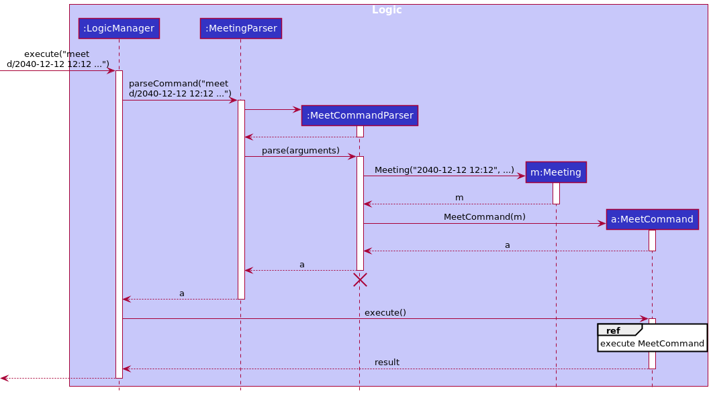

:information_source: **Note:** The lifeline for `MeetCommandParser` should end at the destroy marker (X) but due to a limitation of PlantUML, the lifeline reaches the end of the diagram.

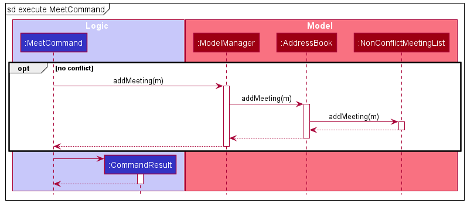

Whenever a meeting is added to the list, the meeting will be inserted in a way such that the earliest meeting (in terms of date) is at the top of the list, and the latest meeting is at the back of the list. 

#### Design considerations

**Aspect: Representation of a Meeting**

* **Alternative 1 (current choice):** Meeting is not linked with any contacts in NewAddressBook.
  * Pros: Users can have more flexibility in planning meetings with any persons, provided they specify the type of persons (parents, teachers, or students) attending the meeting.
  * Cons: Users will need to come up with their own title for each meeting

* **Alternative 2:** Meeting references a Person (either Student or Teacher) stored in NewAddressBook.
  * Pros: User just have to specify the type and index of the Person in the list and the UI would generate a pre-defined title with the specified person's name
  * Cons: Harder to implement, as there is a need to update or remove meetings whenever the referenced Person is updated or removed.

We chose alternative 1 because it makes the application easier to use. That way, users do not have to add in a contact into the address book in order to have a meeting with them.

### Filter command

#### Implementation details

We discuss only the student case here, since it is the same for teachers.

When a `filterStudent` is called, it uses the `filterStudentCommandParser` to parse the additional inputs given by the 
user, such as the filter categories given. It then creates a `StudentInvolvementContainsKeywordsPredicate` with the relevant keywords entered by the user, and passes this predicate object to the `FilterStudentCommand` which gets and updates the view using `model.getFilteredStudentList()` 
and `model.updateFilteredStudentList(predicate)`.

The following sequence diagram shows how it works for a filterStudent command.

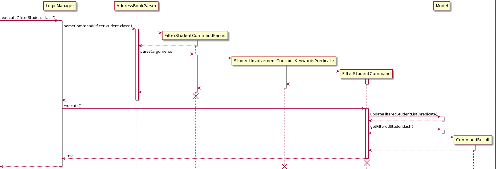

#### Design considerations

**Aspect: How to implement Filter:**

* **Alternative 1 (current choice):** Adapts find command.
    * Pros: Easy to implement, saves time.
    * Cons: Only provides one level filter.

* **Alternative 2:** Make a copy of the list of students upon calling `model.updateFilteredStudentList(predicate)` and filter from the copied list till the user no longer needs to be filtered.
    * Pros: Allows for greater options in filtering, like nested filters etc.
    * Cons: Harder to implement as it requires constantly choosing which list to use.

###  Adding medical history of students

#### Implementation Details
The `MedicalHistoryCommand` extends the `Command` class. When a `MedicalHistoryCommand` is called, it uses the
`MedicalHistoryCommandParser` to parse the inputs given by the user, which include the index of the student based on the 
list of students, and the desired medical history to assign to the student. The parser then passes the details to 
`MedicalHistoryCommand` which then updates the student with the desired medical history using 
`model.setStudent(studentToEdit, editedStudent)` and updates the view using `model.updateFilteredStudentList(predicate)`
This works as the command is supported by the method in the `Model` interface, specifically the `Model#setStudent()` and
`Model#updateFilteredStudentList()` methods.

:information_source: **Note:** One cannot add medical history to teachers.

Given below is an example usage scenario and how the mechanism works.

Step 1. The user launches the application for the first time. The `filteredStudentList` (and teacher list) will be 
initialised from the saved data.

Step 2. The user types the command `medical INDEX m/MEDICAL_HISTORY` to add the `medicalHistory` to the desired `student`
at `index`. The `medical` command calls Model#getFilteredStudentList to obtain the current list of students, then finds
the desired student based on the `index`, and proceeds to edit the `medicalHistory` field of the student. Then the 
Model#updateFilteredStudentList is called to show the updated list with the added `medicalHistory`.

The following sequence diagram shows how the `medical` command works.

#### Design considerations

**Aspect: How to implement MedicalHistory:**

* **Alternative 1 (current choice):** Add the `medicalHistory` only when the teacher wants to.
    * Pros: Saves the user time as most students do not have notable `medicalHistory`.
    * Cons: Slightly more complicated than forcing users to input a `medicalHistory` each time they add a student.

* **Alternative 2:** Allow users to use the `editStudent` command to edit the `medicalHistory`
    * Pros: Easier to implement
    * Cons: Not as specific as using the `medical` command
  
* **Alternative 3:** Force users to input `medicalHistory` for each `student` they wish to add.
    * Pros: Easier to implement
    * Cons: Does not make sense as most students do not have notable `medicalHistory`

###  Clear Command

#### Implementation Details

We discuss only students here, since it is the same for teachers.

The clearStudentCommand classes extends the `Command` class with the ability to clear the current list of students that is being shown.
This is done via the method `Model#massDeleteStudent`. This command will act on the last shown list to the user,
which means that the user can filter the list of students and clear only those that are filtered. This works similarly for teachers as well

As such, this command is supported by the method in the `Model` interface,
namely the `Model#getFilteredStudentList` and `Model#getFilteredTeacherList`.

Given below is an example usage and how the clear mechanism behaves.

Step 1. The user launches the application for the first time. The current `filteredStudentList` and `filteredTeacherList`
will be initialized with all the students and teachers respectively from the loaded book data.

Step 2. The user executes `filterStudent math` to get all the students with the string `math` in their involvement.
The filtered students will be stored in `Model#filteredStudent` and the list will be shown to the user.

Step 3. The user executes `ClearStudent`to clear the current list of filtered students.
The `ClearStudent` command calls `Model#massDeleteStudents`, deleting the students in the current filtered list from
both the `Model#filteredStudent` and `AddressBook#uniqueStudentList`.

Step 4. As the `Model#filteredStudent` is now empty, the GUI will now show an empty list of students.

The following sequence diagram shows how the clear operation works for a `clearStudent` command.
The `clearTeacher` command works similarly.

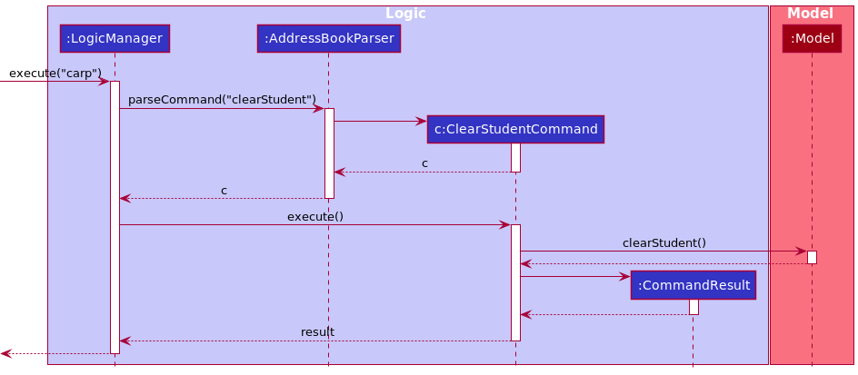

:information_source: 
  **Note:** The lifeline for `ClearStudentCommandParser` and `ClearStudentCommand` should end at the destroy marker (X) but due to a limitation of PlantUML, the lifeline reaches the end of the diagram.

#### Design considerations

**Aspect: How clear executes:**

* **Alternative 1 (current choice):**  Clears only the filtered list
    * Pros: Makes it more flexible for the user, so that they can selectively filter a list they want to delete.
    * Pros: Goes hand in hand with Filter/Find.
    * Cons: Harder to implement and may have a performance issue in terms of memory usage.

* **Alternative 2:** Clears the entire list
    * Pros: Easier to maintain as it will be the same as the initial Clear Command
    * Cons: No way for the user to selectively mass delete.

## **Documentation, logging, testing, configuration, dev-ops**

* [Documentation guide](Documentation.md)
* [Testing guide](Testing.md)
* [Logging guide](Logging.md)
* [Configuration guide](Configuration.md)
* [DevOps guide](DevOps.md)

--------------------------------------------------------------------------------------------------------------------

## **Appendix: Requirements**

### Product scope

**Target user profile**:

* Secondary school teachers who needs to manage many students/teachers, who might have different relationships with the teacher
* Prefer desktop apps over other types
* Can type fast
* Prefer typing to mouse interactions
* Is reasonably comfortable using CLI apps

**Value proposition**: manage contacts faster than a typical mouse/GUI driven app, allows teachers to find their contacts easily

### User stories

Priorities: High (must have) - `* * *`, Medium (nice to have) - `* *`, Low (unlikely to have) - `*`

#### User stories which are implemented

| Priority | As a …​                                    | I want to …​                     | So that I can…​                                                        |
| -------- | ------------------------------------------ | ------------------------------ | ---------------------------------------------------------------------- |
| `* * *`  | teacher                                       | add a new person               |        add a new person to my class                                                            |
| `* * *`      | potential user | clear test app data          | fill the app with my own data quickly                                             |
| `* * *`      | teacher with a lot of contacts | copy fields from people in my address book         | paste it into a communication app so that I can contact them quickly                                             |
| `* * *`  | teacher                                       | delete a person                | remove entries that I no longer need                                   |
| `* * *`  | teacher                                       | edit a specific attribute of a person                | edit their details quickly without deleting and re-adding that person all over again |
| `* * *`  | teacher                                       | find a person by name or by their other attributes          | locate details of persons without having to go through the entire list |
| `* * *`  | potential user                                       | list my contacts          | access the details of my contacts easily for when I need to contact  them |
| `* * *`      | potential user |see clear documentation        | know how to use the app                                           |
| `* * *`      | teacher | to be able to access the medical history of my students          | know which students needs special attention                     
| `* * *`      | teacher that works in the CLI quickly |be able to undo events       | undo in case I accidentally make mistakes while typing quickly       |

#### User stories which are not implemented      

| Priority | As a …​                                    | I want to …​                     | So that I can…​                                                        |
| -------- | ------------------------------------------ | ------------------------------ | ---------------------------------------------------------------------- |
| `* *`      | teacher with many persons in the address book | sort persons by name           | locate a person easily  |
| `*`      | teacher | store the grades of my students      |  know which students need the most help |

### Use cases

(For all use cases below, the **System** is the `NewAddressBook` and the **Actor** is the `user`, unless specified otherwise)

#### List of use cases 
1. [Adding a student/teacher/meeting](#use-case-01-adding-a-student-teacher-or-meeting)
2. [Clearing student/teachers/meetings from the currently displayed list](#use-case-02-clearing-students-teachers-or-meetings)
3. [Copy fields from students/teachers](#use-case-03-copying-fields-from-students-or-teachers)
4. [Deleting students/teachers/meetings](#use-case-04-deleting-a-student-teacher-or-meeting)
5. [Editing a student/teacher](#use-case-05-editing-a-student-or-teacher)
6. [Finding a student/teacher by name](#use-case-06-finding-a-student-or-teacher-by-name)
7. [Filtering a student/teacher by tag](#use-case-07-filtering-a-student-or-teacher-by-involvement-or-tag)
8. [Listing all students/teachers](#use-case-08-listing-all-students-or-teachers)
9. [Adding a medical history to a student](#use-case-09-adding-a-medical-history-to-a-student)
10. [Showing the medical history of a student](#use-case-10-showing-the-medical-history-of-a-student)
11. [Showing help](#use-case-11-showing-help)
12. [Showing meetings](#use-case-12-showing-meetings)
13. [Undoing actions](#use-case-13-undoing-actions)
14. [Quitting meetings window](#use-case-14-quitting-meetings-window)
15. [Quitting the application](#use-case-15-quitting-the-application)

#### Use Case 01: Adding a student, teacher, or meeting

**MSS**
1.  User requests to add a student, teacher, or meeting.
2.  The user provides the parameters of the student, teacher, or meeting to add.
2.  NewAddressBook adds the student, teacher, or meeting.

    Use case ends.

Extensions:
* 2a. The attributes of the student, teacher, or meeting the user requests to add are invalid.

  * 2a1. NewAddressBook notifies the user that some of their inputs are invalid.

    Use case ends.

* 3a. The student, teacher, or meeting already exists.

    * 3a1. NewAddressBook notifies the user that the student, teacher, or meeting already exists.

      Use case ends.

#### Use Case 02: Clearing students, teachers or meetings

**MSS**
1.  User requests to clear students, teachers or meetings in the currently displayed list.
2.  NewAddressBook clears the list of students, teachers or meetings.

    Use case ends.

Extensions:
* 1a. The currently displayed list is empty.

  * 1a1. NewAddressBook notifies the user that there is nothing to clear. No action is performed.

      Use case ends.

#### Use Case 03: Copying fields from students or teachers

**MSS**
1.  User requests to copy a field from the currently displayed list of students or teachers.
2.  User provides the field to copy.
3.  NewAddressBook copies the field specified by the user to the clipboard.

    Use case ends.

Extensions:
* 2a. The field the user asks to copy is invalid.

  * 2a1. NewAddressBook notifies the user that his input is invalid.

      Use case ends.
      
* 3a. The currently displayed list is empty.

  * 3a1. NewAddressBook notifies the user that there is nothing to copy. Nothing is copied to the clipboard.

      Use case ends.

#### Use Case 04: Deleting a student, teacher, or meeting

**MSS**

1.  User requests to delete a specific person at an index in the list.
2.  User provides the index of the student, teacher, or meeting to delete.
2.  NewAddressBook deletes the person

    Use case ends.

**Extensions**
* 1a. The given index is invalid.

    * 1a1. NewAddressBook informs the user that index is invalid.

      Use case ends.

#### Use Case 05: Editing a student or teacher

**MSS**

1. User requests to edit a specific person at an index in the list.
2. The user provides the fields to edit, as well as the new values.
3. NewAddressBook edits the person.

    Use case ends.

**Extensions**
* 2a. The given index is invalid.

    * 2a1. NewAddressBook informs the user that index is invalid.

      Use case ends.

* 3a. All new values provided are already possessed by the existing person.

    * 3a1. NewAddressBook informs the user that there is nothing is edited. No action is performed.

      Use case ends.

#### Use Case 06: Finding a student or teacher by name

**MSS**

1. User requests to find a specific student or teacher by name.
2. User enters the name to find.
3. NewAddressBook finds all matching students or teachers.

    Use case ends.

**Extensions**
* 2a. No students/teachers match the name specified by the user.

    * 2a1. NewAddressBook displays an empty list to the user.

      Use case ends.

#### Use Case 07: Filtering a student or teacher by involvement or tag

**MSS**

1. User requests to find a specific student or teacher by involvement or tag.
2. User provides the involvement and tag values to search for.
3. NewAddressBook finds all matching students or teachers.

    Use case ends.

**Extensions**
* 2a. The tag values provided are invalid (ie. contain alphanumeric characters).

    * 2a1. NewAddressBook tells the user that his input is invalid.

      Use case ends.

* 3a. No students/teachers match the name specified by the user.

    * 3a1. NewAddressBook displays an empty list to the user.

      Use case ends.

#### Use Case 08: Listing all students or teachers

**MSS**

1. User requests to list all students or teachers.
2. NewAddressBook lists all students or teachers for the user.

    Use case ends.

**Extensions**
* 1a. The list of students or teachers is empty.

    * 1a1. NewAddressBook displays an empty list to the user.

      Use case ends.

#### Use Case 09: Adding a medical history to a student

**MSS**

1. User requests to add a medical history for the student.
2. User provides the index and relevant medical history for the student.
3. NewAddressBook overrides the old medical history of the student with a new one.

    Use case ends.

**Extensions**
* 2a. The given index is invalid.

    * 2a1. NewAddressBook informs the user that the index is invalid.

      Use case ends.

* 2b. The user provides an empty string as the medical history.

    * 2b1. NewAddressBook overrides the medical history with an empty string.

      Use case ends.

#### Use Case 10: Showing the medical history of a student

**MSS**

1. User requests to show a medical history for the student.
2. User provides the index of the student to show.
3. NewAddressBook pops out a window to show the student's medical history.

    Use case ends.

**Extensions**
* 2a. The given index is invalid.

    * 2a1. NewAddressBook shows informs the user that the index is invalid.

      Use case ends.

* 3a. The window is already open.

    * 3a1. The window is brought to the foreground.

      Use case ends.

* 3b. The student has no medical history.

    * 3b1. The window displays the name of the student only, with no medical history field.

      Use case ends.

#### Use Case 11: Showing help

**MSS**

1. User requests to show help.
2. NewAddressBook pops out the help window.

    Use case ends.

**Extensions**
* 2a. The window is already open.

    * 2a1. The window is brought to the foreground.

      Use case ends.

#### Use Case 12: Showing meetings

**MSS**

1. User requests to show the meeting window.
2. NewAddressBook pops out the meeting window.

    Use case ends.

**Extensions**
* 2a. The window is already open.

    * 2a1. The window is brought to the foreground.

      Use case ends.

#### Use Case 13: Undoing actions

**MSS**

1. User requests to undo the last action.
2. NewAddressBook undoes the last action.

    Use case ends.

**Extensions**
* 2a. The user is already at the oldest change.

    * 2a1. NewAddressBook tells the user that they are already at the oldest change. No action is taken.

      Use case ends.

#### Use Case 14: Quitting meetings window

**Preconditions:** The meeting window is already open.  

**MSS**

1. User requests to quit the meeting window from the meeting window.
2. NewAddressBook exits the meeting window.

    Use case ends.

#### Use Case 15: Quitting the application

**MSS**

1. User requests to quit the application.
2. NewAddressBook quits.

    Use case ends.

### Non-Functional Requirements

1.  Should work on any _mainstream OS_ as long as it has Java `11` or above installed.
2.  Should be able to hold up to 1000 persons without a noticeable sluggishness in performance for typical usage.
3.  A user with above average typing speed for regular English text (i.e. not code, not system admin commands) should be able to accomplish most of the tasks faster using commands than using the mouse.

### Glossary

* **Mainstream OS**: Windows, Linux, Unix, OS-X
* **Private contact detail**: A contact detail that is not meant to be shared with others
* **Involvement**: A label attached to each student/teacher specifying the person's involvement with the User.

--------------------------------------------------------------------------------------------------------------------

## **Appendix: Instructions for manual testing**

Given below are instructions to test the app manually.

:information_source: **Note:** These instructions only provide a starting point for testers to work on;
testers are expected to do more *exploratory* testing.

### Launch and shutdown

1. Initial launch

   1. Download the jar file and copy it into an empty folder

   2. Double-click the jar file Expected: Shows the GUI with a set of sample contacts. The window size may not be optimum.

2. Saving window preferences

   1. Resize the window to an optimum size. Move the window to a different location. Close the window.

   2. Re-launch the app by double-clicking the jar file. 
       Expected: The most recent window size and location is retained.

:information_source: **Note:** For the below, we just state test cases for students. Even though the commands for teachers and meetings could be different, the key ideas of what the test cases are meant to test remains the same. From now on, when we say `list`, we mean the **currently displayed list**.

### Basic contact management

This section tests the basic functionality of the application.

#### Adding a Student

1. Adding a student with all fields correct.

   1. Test case: `student n/John Doe p/98765432 e/johnd@example.com g/M a/311, Clementi Ave 2, #02-25 f/3E1 em/999 i/Math class t/naughty` 
      Expected: Student John Does is added to the list.

2. Adding a duplicate student.

    1. Prerequisites: The test case above is executed.

    1. Test case: execute **again** `student n/John Doe p/98765432 e/johnd@example.com g/M a/311, Clementi Ave 2, #02-25 f/3E1 em/999 i/Math class t/naughty` 
        Expected: Student John Does is not added to the list. A message similar to a duplicate student message shows up.

3. Adding a student with an empty field.

    1. Test case: `student n/John Doe p/ e/johnd@example.com g/M a/311, Clementi Ave 2, #02-25 f/3E1 em/999 i/Math class t/naughty` 
    
        Expected: Student John Does is not added to the list. A message saying the phone number has an invalid input pops out.

#### Clearing the student list

1. Clearing the student list.

   1. Prerequisites: The displayed student list has more than one person.

   1. Test case: `clearStudent` 
      Expected: The student address list is cleared.

2. Clearing an empty list.

    1. Prerequisites: The test case above is executed.

    1. Test case: execute **again** `clearStudent` 
        Expected: A message saying that there are no students to clear shows up.

#### Copying student fields

1. Copying student fields.

   1. Prerequisites: The list is non-empty.

   1. Test case: `copyStudent c/email` 
      Expected: A list of email addresses are copied.

2. Invalid field.

    1. Test case: execute **again** `copyStudent c/fish` 
        Expected: A message saying that the field is invalid should show up.

3. Copying from an empty list.

    1. Prerequisites: The list is **empty**.

    1. Test case: `copyStudent c/phone` 
        Expected: A message saying that the list is empty and that nothing was copied should show up. Check the clipboard to make sure the app did not override its contents.

#### Deleting a student

1. Delete a student with valid index.

   1. Prerequisites: The list has at least one person.

   1. Test case: `deleteStudent 1` 
      Expected: A first student is deleted.

2. Delete a student with an invalid index.

    1. Prerequisites: The list has less than or equal to 99 people.

    1. Test case: `deleteStudent 100` 
        Expected: A message saying that the index is invalid should show up.

    1. Test case: `deleteStudent -1`  
        Expected: A message saying that the command format is invalid should show up.

### Editing Fields

This section tests the editing functionality of the application. We have to be extra careful here to make sure we do not do anything when the user provides the same fields to edit multiple times. Else, some `undo` operations might not be meaningful. For example, if the user repeatedly executes `editStudent 1 p/91234567 e/johndoe@example.com` three times, we do not want to execute `undo` three times to undo the last action.

#### Editing students

1. Edit a student with valid index and parameters.

   1. Prerequisites: The list has at least one person.

   1. Test case: `editStudent 1 p/91234567 e/johndoe@example.com` 
      Expected: The fields of the first student are edited to that specified in the test case.

1. Edit a student with blank parameters.

   1. Prerequisites: The list has at least one person.

   1. Test case: `editStudent 1 p/ e/johndoe@example.com` 
      Expected: An error similar to an invalid phone number command format should pop up.

1. Edit a student with parameters that that student already has.

   1. Prerequisites: The list has at least one person.

   1. Test case: execute **twice** `editStudent 1 p/91234567 e/johndoe@example.com` 
      Expected: An error saying that the student already has the same fields should pop up on the second command execution.

#### Editing medical history

1. Edit a student's medical history with valid parameters.

   1. Prerequisites: The list has at least one person.

   1. Test case: `medical 1 m/dead` 
      Expected: The medical history of the first student is set to dead.

1. Edit a student's medical history with blank parameters. This will erase the students existing medical history.

   1. Prerequisites: The list has at least one person. Test case 1 has already been executed.

   1. Test case: `medical 1 m/` 
      Expected: The medical history of the first student is removed.

1. Editing a student's medical history with one that he already has.

   1. Prerequisites: The list has at least one person.

   1. Test case: execute **twice** `medical 1 m/dead` 

      Expected: An error saying that the student already has same medical history should show up.

### Find and filter
These commands test the finding/filter capabilities of the application.

1. Find matching conditions: checks to make sure `findStudent` matches the **whole** word

   1. Prerequisites: clear the student list with `listStudent` and `clearStudent`. Add two students to the student list using `student n/John Doe p/98765432 e/johnd@example.com g/M a/311, Clementi Ave 2, #02-25 f/3E1 em/999 i/Math class t/naughty` and `student n/John Smith p/98765432 e/johns@example.com g/M a/311, Clementi Ave 2, #02-25 f/3E1 em/999 i/Math class t/naughty`

   1. Test case: `findStudent John` 
      Expected: Both students should be listed.

   1. Test case: `findStudent Jo` 
      Expected: No students should be listed.

   1. Test case: `findStudent Smith` 
      Expected: Only John Smith should be listed.

1. Filter matching conditions: checks to make sure `findStudent` matches **part** of the word, and that the search is an **AND** search

   1. Prerequisites: clear the student list with `listStudent` and `clearStudent`. Add two students to the student list using `student n/John Doe p/98765432 e/johnd@example.com g/M a/311, Clementi Ave 2, #02-25 f/3E1 em/999 i/Math class t/naughty` and `student n/John Smith p/98765432 e/johns@example.com g/M a/311, Clementi Ave 2, #02-25 f/3E1 em/999 i/English class t/naughty t/dead` (these commands are not the same as above!)

   1. Test case: `filterStudent class` 
      Expected: Both students should be listed.

   1. Test case: `filterStudent eng` 
      Expected: Only John Smith should be listed.

   1. Test case: `filterStudent t/dead` 
      Expected: Only John Smith should be listed.

   1. Test case: `filterStudent t/dea` 
     Expected: Only John Smith should be listed.

   1. Test case: `filterStudent t/a` 
     Expected: Both students should be listed.
  
   1. Test case: `filterStudent class t/a` 
     Expected: Both students should be listed.

   1. Test case: `filterStudent english t/a` 
     Expected: Only John Smith should be listed.

   1. Test case: `filterStudent english t/naughty` 
     Expected: Only John Smith should be listed.

   1. Test case: `filterStudent english t/naughty t/fish` 
     Expected: No students should be listed.

3. Checks case insensitivity
   1. Prerequisites: clear the student list with `listStudent` and `clearStudent`. Add two students to the student list using `student n/John Doe p/98765432 e/johnd@example.com g/M a/311, Clementi Ave 2, #02-25 f/3E1 em/999 i/Math class t/naughty` and `student n/John Smith p/98765432 e/johns@example.com g/M a/311, Clementi Ave 2, #02-25 f/3E1 em/999 i/Math class t/Naughty`

    1. Test case: `filterStudent t/naughty` 
    Expected: Both students should be listed.

### Date time management
This section tests if the date management is as expected. Since dates are only used in meetings, the tester would need to open up the meeting window.

#### Date management

   1. Prerequisites: open up the meeting window with `showMeeting`.

   1. Test case: `meet r/Meeting with Ms.Lee d/2040-07-12 14:08 v/Seminar room 3 w/P` 
    This is a valid meeting date and hence should be accepted.

   1. Test case: `meet r/Meeting with Ms.Lee d/2040:07-12 14:08 v/Seminar room 3 w/P` 
    A message saying that the user's date time input is invalid should pop out.

  1. Test case: `meet r/Meeting with Ms.Lee d/2019-07-12 14:08 v/Seminar room 3 w/P` 
    A message saying that the meeting date should be in the future should pop up.

  1. Test case: `meet r/Meeting with Ms.Lee d/2022-7-12 14:08 v/Seminar room 3 w/P` 
    A message saying that the user's date time input is invalid should pop out. The user is supposed to pad it with zeroes if the month is single digit.

  1. Test case: `meet r/Meeting with Ms.Lee d/2028-02-29 14:08 v/Seminar room 3 w/P` 
    This is a valid meeting date and hence should be accepted. 2028 is a leap year.

  1. Test case: `meet r/Meeting with Ms.Lee d/2029-02-29 14:08 v/Seminar room 3 w/P` 
    A message saying that the user's date time input is invalid should pop out. 2029 is not a leap year.

#### Time management

  1. Prerequisites: open up the meeting window with `showMeeting`.

  1. Test case: `meet r/Meeting with Ms.Lee d/2029-01-29 24:08 v/Seminar room 3 w/P` 
    A message saying that the user's date time input is invalid should pop out. 24:08 is not a valid time.

### Window management
This section ensures that the application "knows" about where the user is executing the commands from.

#### Window specific commands

  1. Prerequisites: open up the meeting window with `showMeeting`.
  
  1. Test case: In the main window, execute `meet`. 
    The app should respond that the command is invalid.

  1. Test case: In the meeting window, execute `meet`. 
    The app should respond that it knows the command, but the format is invalid.

#### Undo across various windows

This tests if `undo` works as expected multiple windows. 

  1. Prerequisites: open up the meeting window with `showMeeting`. In the main window, execute `editStudent 1 p/91234567 e/johndoe@example.com`.  In the meeting window, execute `meet r/Meeting with Ms.Lee d/2029-02-21 14:08 v/Seminar room 3 w/P`.

  2. Test case: execute `undo` in the **main** window.  
    The meeting added should be cleared, but the effects of the first command should still be there.

### Undo command

The `undo` command needs extra testing, because it integrates with a lot of other commands.

1. Undo success

   1. Prerequisites: clear the student list with `listStudent` and `clearStudent`. Add two students to the student list using `student n/John Doe p/98765432 e/johnd@example.com g/M a/311, Clementi Ave 2, #02-25 f/3E1 em/999 i/Math class t/naughty` and `student n/John Smith p/98765432 e/johns@example.com g/M a/311, Clementi Ave 2, #02-25 f/3E1 em/999 i/English class t/naughty t/dead`.

   2. Test case: Execute `undo` two times. 
    Both students should be removed.

1. Undo at oldest change

   1. Prerequisites: Clear the student list with `listStudent` and `clearStudent`. Close the app and reopen it. Add two students to the student list using `student n/John Doe p/98765432 e/johnd@example.com g/M a/311, Clementi Ave 2, #02-25 f/3E1 em/999 i/Math class t/naughty` and `student n/John Smith p/98765432 e/johns@example.com g/M a/311, Clementi Ave 2, #02-25 f/3E1 em/999 i/English class t/naughty t/dead`.

   2. Test case: Execute `undo` **three** times. 
    Both students should be removed. On the last `undo`, the application should tell the user that he/she is already at the oldest change.

1. Undo an edit action that does nothing

   1. Prerequisites: clear the student list with `listStudent` and `clearStudent`. Add a student list using `student n/John Doe p/98765432 e/johnd@example.com g/M a/311, Clementi Ave 2, #02-25 f/3E1 em/999 i/Math class t/naughty`. Now edit that student using `editStudent 1 i/Math class`. An error message should show up, saying that 

   2. Test case: Execute `undo` once. 
    The added student should be removed. It shouldn't take two `undo` actions to do so as the `editStudent` command did nothing.

### Saving data

This section deals with test cases that come with saving data.

#### Deleted data files

  1. Quit the application and delete `data/newaddressbook.json`. Reopen the application. 

  2. Test case: the application should now be reloaded with the default data.

#### Renamed data files

  1. Quit the application and rename `data/newaddressbook.json` to `data/fish.json`. Reopen the application. 

  2. Test case: the application should now be reloaded with the default data.

#### Corrupted data files

  1. Quit the application and change the content inside `data/newaddressbook.json` to `fish fish fish`. Save and close the `json` file, and reopen the application. 

  2. Test case: the data of the application is cleared.
