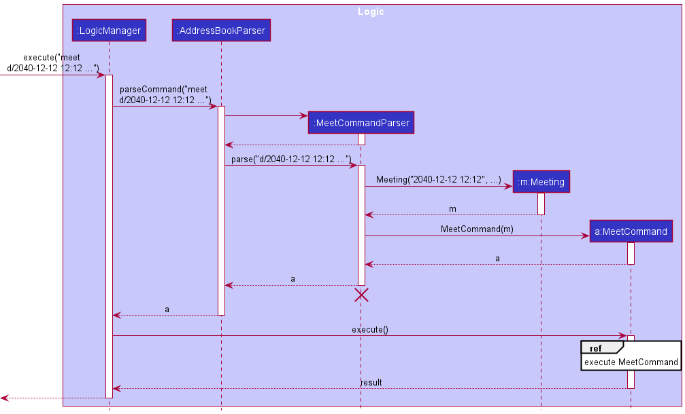

* Table of Contents
{:toc}

--------------------------------------------------------------------------------------------------------------------

## **Acknowledgements**

* {list here sources of all reused/adapted ideas, code, documentation, and third-party libraries -- include links to the original source as well}

--------------------------------------------------------------------------------------------------------------------

## **Setting up, getting started**

Refer to the guide [_Setting up and getting started_](SettingUp.md).

--------------------------------------------------------------------------------------------------------------------

## **Design**

:bulb: **Tip:** The `.puml` files used to create diagrams in this document can be found in the [diagrams](https://github.com/se-edu/addressbook-level3/tree/master/docs/diagrams/) folder. Refer to the [_PlantUML Tutorial_ at se-edu/guides](https://se-education.org/guides/tutorials/plantUml.html) to learn how to create and edit diagrams.

### Architecture

The ***Architecture Diagram*** given above explains the high-level design of the App.

Given below is a quick overview of main components and how they interact with each other.

**Main components of the architecture**

**`Main`** has two classes called [`Main`](https://github.com/se-edu/addressbook-level3/tree/master/src/main/java/seedu/address/Main.java) and [`MainApp`](https://github.com/se-edu/addressbook-level3/tree/master/src/main/java/seedu/address/MainApp.java). It is responsible for,
* At app launch: Initializes the components in the correct sequence, and connects them up with each other.
* At shut down: Shuts down the components and invokes cleanup methods where necessary.

[**`Commons`**](#common-classes) represents a collection of classes used by multiple other components.

The rest of the App consists of four components.

* [**`UI`**](#ui-component): The UI of the App.
* [**`Logic`**](#logic-component): The command executor.
* [**`Model`**](#model-component): Holds the data of the App in memory.
* [**`Storage`**](#storage-component): Reads data from, and writes data to, the hard disk.

**How the architecture components interact with each other**

The *Sequence Diagram* below shows how the components interact with each other for the scenario where the user issues the command `deleteStudent 1`.

Each of the four main components (also shown in the diagram above),

* defines its *API* in an `interface` with the same name as the Component.
* implements its functionality using a concrete `{Component Name}Manager` class (which follows the corresponding API `interface` mentioned in the previous point.

For example, the `Logic` component defines its API in the `Logic.java` interface and implements its functionality using the `LogicManager.java` class which follows the `Logic` interface. Other components interact with a given component through its interface rather than the concrete class (reason: to prevent outside component's being coupled to the implementation of a component), as illustrated in the (partial) class diagram below.

The sections below give more details of each component.

### UI component

The **API** of this component is specified in [`Ui.java`](https://github.com/se-edu/addressbook-level3/tree/master/src/main/java/seedu/address/ui/Ui.java)

The UI consists of a `MainWindow` that is made up of parts e.g.`CommandBox`, `ResultDisplay`, `StudentListPanel`, `TeacherListPanel`, `StatusBarFooter` etc. All these, including the `MainWindow`, inherit from the abstract `UiPart` class which captures the commonalities between classes that represent parts of the visible GUI.

The `MeetingWindow` in `MainWindow` is made up of parts as well e.g. `CommandBox`, `ResultDisplay`, `MeetingListPanel`. Which also inherit from abstract `UiPart` similar to the MainWindow

The `UI` component uses the JavaFx UI framework. The layout of these UI parts are defined in matching `.fxml` files that are in the `src/main/resources/view` folder. For example, the layout of the [`MainWindow`](https://github.com/se-edu/addressbook-level3/tree/master/src/main/java/seedu/address/ui/MainWindow.java) is specified in [`MainWindow.fxml`](https://github.com/se-edu/addressbook-level3/tree/master/src/main/resources/view/MainWindow.fxml)

The `UI` component,

* executes user commands using the `Logic` component.
* listens for changes to `Model` data so that the UI can be updated with the modified data.
* keeps a reference to the `Logic` component, because the `UI` relies on the `Logic` to execute commands.
* depends on some classes in the `Model` component, as it displays `Student` and `Teacher` object residing in the `Model`.

### Logic component

**API** : [`Logic.java`](https://github.com/se-edu/addressbook-level3/tree/master/src/main/java/seedu/address/logic/Logic.java)

Here's a (partial) class diagram of the `Logic` component:

How the `Logic` component works:
1. When `Logic` is called upon to execute a command, it uses the `AddressBookParser` class to parse the user command.
1. This results in a `Command` object (more precisely, an object of one of its subclasses e.g., `AddCommand`) which is executed by the `LogicManager`.
1. The command can communicate with the `Model` when it is executed (e.g. to add a student).
1. The result of the command execution is encapsulated as a `CommandResult` object which is returned back from `Logic`.

The Sequence Diagram below illustrates the interactions within the `Logic` component for the `execute("deleteStudent 1")` API call.

:information_source: **Note:** When the user calls a valid command 
from the `Meeting` window, the interaction within the `Logic` component only has 1 key difference: `LogicManager` 
calls the `MeetingParser#parseCommand`. The rest of the implementation is similar to the diagram below.

:information_source: **Note:** The lifeline for `DeleteStudentCommandParser` should end at the destroy marker (X) but due to a limitation of PlantUML, the lifeline reaches the end of diagram.

Here are the other classes in `Logic` (omitted from the class diagram above) that are used for parsing a user command:

How the parsing works:
* When called upon to parse a user command, the `AddressBookParser` class creates an `XYZCommandParser` (`XYZ` is a placeholder for the specific command name e.g., `AddCommandParser`) which uses the other classes shown above to parse the user command and create a `XYZCommand` object (e.g., `AddCommand`) which the `AddressBookParser` returns back as a `Command` object.
* All `XYZCommandParser` classes (e.g., `AddCommandParser`, `DeleteCommandParser`, ...) inherit from the `Parser` interface so that they can be treated similarly where possible e.g, during testing.

### Model component
**API** : [`Model.java`](https://github.com/se-edu/addressbook-level3/tree/master/src/main/java/seedu/address/model/Model.java)

The `Model` component,

* stores the address book data i.e., all `Person` objects (which are contained in a `UniquePersonList` object).
* stores the currently 'selected' `Person` objects (e.g., results of a search query) as a separate _filtered_ list which is exposed to outsiders as an unmodifiable `ObservableList<Person>` that can be 'observed' e.g. the UI can be bound to this list so that the UI automatically updates when the data in the list change.
* stores a `UserPref` object that represents the user’s preferences. This is exposed to the outside as a `ReadOnlyUserPref` objects.
* does not depend on any of the other three components (as the `Model` represents data entities of the domain, they should make sense on their own without depending on other components)

:information_source: **Note:** An alternative (arguably, a more OOP) model is given below. It has a `Tag` list in the `AddressBook`, which `Person` references. This allows `AddressBook` to only require one `Tag` object per unique tag, instead of each `Person` needing their own `Tag` objects. 

### Storage component

**API** : [`Storage.java`](https://github.com/se-edu/addressbook-level3/tree/master/src/main/java/seedu/address/storage/Storage.java)

The `Storage` component,
* can save both address book data and user preference data in json format, and read them back into corresponding objects.
* inherits from both `AddressBookStorage` and `UserPrefStorage`, which means it can be treated as either one (if only the functionality of only one is needed).
* depends on some classes in the `Model` component (because the `Storage` component's job is to save/retrieve objects that belong to the `Model`)

### Common classes

Classes used by multiple components are in the `seedu.addressbook.commons` package.

--------------------------------------------------------------------------------------------------------------------

## **Implementation**

This section describes some noteworthy details on how certain features are implemented.

### Undo feature

#### Implementation details

The undo mechanism is facilitated by a stack inside `ModelManager`. Every time the address book updates, a copy of the address book is made is made and is pushed on the stack. As such, `ModelManager` exposes the `undo()` method to pop a previous version of an address book from the stack and reload its contents.

:information_source: 
  **Note:** It is needed for one to store a **copy** of the address book, otherwise any modifications to the existing address book would also alter the copies in the stack.

Given below is an example usage scenario and how the undo mechanism behaves at each step.

Step 1. The user launches the application for the first time. The app creates an address book with the initial address book state, and a copy of this address book, `ab0`, will be pushed into the stack.

Step 2. The user executes `deleteStudent 1` command to delete the 1st student in the address book. The `DeleteStudent` command calls `ModelManager::deleteStudent`, which deletes the student from the existing address book, and then pushes a copy of the modified address book, `ab1`, onto the stack.

Step 3. The user executes `student n/David …​` to add a new student. The `add` command also calls `ModelManager::addStudent`, causing another copy of the modified address book, `ab2`, to pushed onto the stack.

:information_source: 
  **Note:** If a command fails its execution, it will not save the address book.

Step 4. The user now decides that adding the person was a mistake, and decides to undo that action by executing the `undo` command. The `undo` command will call `ModelManager::undo`, which will pop the front element from the stack and restore `ab2`'s contents. The top of the stack is now `ab1`.

:information_source: 
  **Note:** If the stack has size 1, it means that copy of the address book inside the stack is the same as when the app first started. In this case, the app does not execute the `undo` operation, but rather tells the user that they are already at the oldest change.

The following sequence diagram shows how the undo operation works:

:information_source: 
**Note:** The lifeline for `UndoCommand` should end at the destroy marker (X) but due to a limitation of PlantUML, the lifeline reaches the end of diagram.

The `undoSuccess` variable in the above diagram is a `boolean`. It is `true` if the undo is a success, `false` otherwise. The undo command could fail if the app is already at the oldest change (ie. the stack size is 1). `undoSuccess` then determines what the `commandResult` will be. 

#### Design considerations:

**Aspect: How undo executes:**

* **Alternative 1 (current choice):** Saves the entire address book.
  * Pros: Easy to implement.
  * Cons: May have performance issues in terms of memory usage.

* **Alternative 2:** Individual command knows how to undo/redo by
  itself. For instance, have an `UndoDeleteStudent` command, `UndoEditTeacher` command etc...
  * Pros: Will use less memory (e.g. for `delete`, just save the person being deleted).
  * Cons: We must ensure that the implementation of each individual command are correct.

We chose Alternative 1 because of the limited timespan of our problem. Also, given that modern computers have large memory, it will not be a problem to store multiple copies of address books if the address book size is not too large.

### Copy Command

#### Implementation details
The `CopyStudentCommand/CopyTeacher` classes extends the `Command` class with the ability to copy a selected field either from a list of students or list of teachers. This is done via the method `CopyStudentCommand::getCopyContent` (similarly for teachers). This command works on the last shown list to the user, which means the user could filter the student list and copy the subset of students filtered. This works similarly for teachers as well. 

As such, this command is supported by the method in the `Model` interface, namely the `Model::getFilteredStudentList()` and `Model::getFilteredTeacherList()` methods.

Given below is an example usage scenario and how the copy mechanism behaves.

Step 1. The user launches the application for the first time. The current `filteredStudentList` and `filteredTeacherList`
will be initialized with the all the students and teachers respectively from the loaded book data.

Step 2. The user executes `copyStudent c/name` to copy all the names of the students that are currently shown in the GUI. The `copyStudent` command calls `Model::getFilteredStudentList`, loading the current list of filtered students, which in this case is all the students from the loaded book data. Afterwards, the `copyStudent` command calls its own `getCopyContent` method, which then calls `CopyCommand::getNameContent` since the user wants to copy all names of students,
appending all the names of the students in the filtered student list to the user's clipboard.

The following sequence diagram shows how the copy operation works for a copyStudent command. The `copyTeacher` command works similarly, so we will only discuss students here. If the user specifies another field to be copied, such as `phone` or `email`, the command also works similarly, so we will not discuss them here.

(Comment: Isn't this diagram too complicated)

:information_source: 
  **Note:** The lifeline for `CopyStudentCommandParser` and `CopyStudentCommand` should end at the destroy marker (X) but due to a limitation of PlantUML, the lifeline reaches the end of diagram.

#### Design considerations:

**Aspect: How copy executes:**

(Comment: Probably need to be more specific about this, and justify why alternative 1 is better)
* **Alternative 1 (current choice):** CopyCommand handles the copying
    * Pros: Easy to implement.
    * Cons: Will not be able to copy across tables.

* **Alternative 2:** Model handles the copying
    * Pros: Easier to maintain and will work like the other commands
    * Cons: Many checks will have to be done to ensure the fields that are copied exists in both the student and teacher class.

:information_source: 
**Note:** The `copyStudent/copyTeacher` command does not copy anything to the clipboard if the last shown list is empty.

### Adding meetings

#### Implementation Details
The mechanism of adding meetings is showcased in the sequence diagram below:

:information_source: **Note:** The lifeline for `UndoCommand` should end at the destroy marker (X) but due to a limitation of PlantUML, the lifeline reaches the end of diagram.

Whenever a Meeting is added to the list, the list will be sorted so that when the user views the upcoming meetings, it will be shown in ascending order.

#### Design considerations:

**Aspect: Representation of a Meeting**

* **Alternative 1 (current choice):** Meeting is not linked with any contacts in NewAddressBook.
  * Pros: Users can have more flexibility of planning meetings with any persons, provided they specify the type of persons (parents, teachers, or students) attending the meeting.
  * Cons: Users will need to come up with their own title for each meeting

* **Alternative 2:** Meeting references a Person (either Student or Teacher) stored in NewAddressBook.
  * Pros: User just have to specify the type and index of the Person in the list and the UI would generate a pre-defined title with the specified person's name
  * Cons: Harder to implement, as there is a need to update or remove meetings whenever the referenced Person is updated or removed.

### Filter command:

#### Implementation: 

We discuss only the student case here, since it is the same for teachers.

When a `filterStudent` is called, it uses the `filterStudentCommandParser` to parse the additional inputs given by the 
user, such as the filter categories given. It then creates a `StudentInvolvementContainsKeywordsPredicate` with the relevant keywords entered by the user, and passes this predicate object to the `FilterStudentCommand` which gets and updates the view using `model.getFilteredStudentList()` 
and `model.updateFilteredStudentList(predicate)`.

The following sequence diagram shows how it works for a filterStudent command.

(Comment: is there really a need for `studentInvolvementContainsKeywordsPredicate` here? Do you need the CommandResult and the `getFilteredStudentList` back? After all, we are just using `getFilteredStudentList` for the size of the list.)

#### Design considerations:

**Aspect: How to implement Filter:**

* **Alternative 1 (current choice):** Adapts find command.
    * Pros: Easy to implement, saves time.
    * Cons: Only provides one level filter.

* **Alternative 2:** Update model itself. For instance, have an `updateFilteredFilteredStudentList(predicate)` command etc...
    * Pros: Allows for greater options in filtering, like nested filters etc.
    * Cons: We must ensure that the implementation of each individual command are correct.

###  Adding medical history of students:

#### Implementation Details
The `MedicalHistoryCommand` extends the `Command` class. When a `MedicalHistoryCommand` is called, it uses the
`MedicalHistoryCommandParser` to parse the inputs given by the user, which include the index of the student based on the 
list of students, and the desired medical history to assign to the student. The parser then passes the details to 
`MedicalHistoryCommand` which then updates the student with the desired medical history using 
model.setStudent(studentToEdit, editedStudent) and updates the view using `model.updateFilteredStudentList(predicate)`
This works as the command is supported by the method in the `Model` interface, specifically the Model#setStudent() and
Model#updateFilteredStudentList() methods.

:information_source: **Note:** Cannot add medical history to teachers.

Given below is an example usage scenario and how the mechanism works.

Step 1. The user launches the application for the first time. The `filteredStudentList` (and teacher list) will be 
initialised from the saved data.

Step 2. The user types the command `medical INDEX m/MEDICAL_HISTORY` to add the `medicalHistory` to the desired `student`
at `index`. The `medical` command calls Model#getFilteredStudentList to obtain the current list of students, then finds
the desired student based on the `index`, and proceeds to edit the `medicalHistory` field of the student. Then the 
Model#updateFilteredStudentList is called to show the updated list with the added `medicalHistory`.

The following sequence diagram shows how the `medical` command works.

#### Design considerations:

**Aspect: How to implement MedicalHistory:**

* **Alternative 1 (current choice):** Add the `medicalHistory` only when the teacher wants to.
    * Pros: Saves the user time as most students do not have notable `medicalHistory`.
    * Cons: Slightly more complicated than forcing users to input a `medicalHistory` each time they add a student.

* **Alternative 2:** Allow users to use the `editStudent` command to edit the `medicalHistory`
    * Pros: Easier to implement
    * Cons: Not as specific than using the `medical` command
  
* **Alternative 3:** Force users to input `medicalHistory` for each `student` they wish to add.
    * Pros: Easier to implement
    * Cons: Does not make sense as most students do not have notable `medicalHistory`

###  Clear Command:

#### Implementation Details

We discuss only student here, since it is the same for teachers.

The clearStudentCommand classes extends the `Command` class with the ability to clear the current list of students that is being shown.
This is done via the method `Model#massDeleteStudent`. This command will act on the last shown list to the user,
which means that the user can filter the list of students and clear only those that are filtered. This works similarly for teachers as well

As such, this command is supported by the method in the `Model` interface,
namely the `Model#getFilteredStudentList` and `Model#getFilteredTeacherList`.

Given below is an example usage and how the clear mechanism behaves.

Step 1. The user launches the application for the first time. The current `filteredStudentList` and `filteredTeacherList`
will be initialized with all the students and teachers respectively from the loaded book data.

Step 2. The user executes `filterStudent math` to get all the students with the string `math` in their involvement.
The filtered students will be stored in `Model#filteredStudent` and the list will be show to the user.

Step 3. The user executes `ClearStudent`to clear the current list of filtered students.
The `ClearStudent` command calls `Model#massDeleteStudents`, deleting the students in the current filtered list from
both the `Model#filteredStudent` and `AddressBook#uniqueStudentList`.

Step 4. As the `Model#filteredStudent` is now empty, the GUI will now show an empty list of students.

The following sequence diagram shows how the clear operation works for a `clearStudent` command.
The `clearTeacher` command works similarly.

:information_source: 
  **Note:** The lifeline for `ClearStudentCommandParser` and `ClearStudentCommand` should end at the destroy marker (X) but due to a limitation of PlantUML, the lifeline reaches the end of diagram.

#### Design considerations:

**Aspect: How clear executes:**

* **Alternative 1 (current choice):**  Clears only the filtered list
    * Pros: Makes it more flexible for the user, so that they can selectively filter a list they want to delete.
    * Pros: Goes hand in hand with Filter/Find.
    * Cons: Harder to implement and may have performance issue in terms of memory usage.

* **Alternative 2:** Clears the entire list
    * Pros: Easier to maintain as it will be the same as the initial Clear Command
    * Cons: No way for the user to selectively mass delete.

:information_source: 
**Note:** The `copyStudent/copyTeacher` command does not copy anything to the clipboard if the last shown list is empty.

:information_source: 
**Note:** As Meeting does not have any means of filtering, clearMeeting uses alternative 2.

**
--------------------------------------------------------------------------------------------------------------------

## **Documentation, logging, testing, configuration, dev-ops**

* [Documentation guide](Documentation.md)
* [Testing guide](Testing.md)
* [Logging guide](Logging.md)
* [Configuration guide](Configuration.md)
* [DevOps guide](DevOps.md)

--------------------------------------------------------------------------------------------------------------------

## **Appendix: Requirements**

### Product scope

**Target user profile**:

* Secondary school teachers who need to manage many students/teachers who are involved with the teacher in many ways
* Prefer desktop apps over other types
* Can type fast
* Prefer typing to mouse interactions
* Is reasonably comfortable using CLI apps

**Value proposition**: manage contacts faster than a typical mouse/GUI driven app, allows teachers to find their contacts easily

### User stories

Priorities: High (must have) - `* * *`, Medium (nice to have) - `* *`, Low (unlikely to have) - `*`

| Priority | As a …​                                    | I want to …​                     | So that I can…​                                                        |
| -------- | ------------------------------------------ | ------------------------------ | ---------------------------------------------------------------------- |
| `* * *`  | teacher who manages a lot of classes                                    | view students in the intersection/union of some of my classes         | find students easily               |
| `* * *`  | teacher                                       | add a new person               |                                                                        |
| `* * *`  | teacher                                       | delete a person                | remove entries that I no longer need                                   |
| `* * *`  | teacher                                       | find a person by name          | locate details of persons without having to go through the entire list |
| `* *`    | teacher                                       | find a student by my involvement with them  | locate details of persons without having to go through the entire list                |
| `* * *`      | teacher with many persons in the address book | sort persons by name           | locate a person easily                                                 |
| `* *`      | teacher | to be able to access the medical history of my students          | know which students needs special attention                                                |
| `* * *`      | potential user | to delete test app data          | fill the app with my own data quickly                                             |
| `* *`      | teacher | want to know the contact details of my fellow teachers        | contact them quickly                                            |
| `* * *`      | potential user |see clear documentation        | know how to use the app                                           |
| `* *`      | teacher that works in the CLI |be able to undo events       | undo in case I accidently delete students                                           |
| `* *`      | teacher | store the grades of my students      |  know which students need the most help                                         |

### Use cases

(For all use cases below, the **System** is the `NewAddressBook` and the **Actor** is the `user`, unless specified otherwise)

**Use case: Delete a person**

**MSS**

1.  User requests to list persons
2.  NewAddressBook shows a list of persons
3.  User requests to delete a specific person in the list
4.  NewAddressBook deletes the person

    Use case ends.

**Extensions**

* 2a. The list is empty.

  Use case ends.

* 3a. The given index is invalid.

    * 3a1. NewAddressBook shows an error message.

      Use case resumes at step 2.

**Use case: Adding grades of a student**

**MSS**

1.  User requests to list persons
2.  NewAddressBook shows a list of persons
3. User requests to edit grades for a specific student
4. NewAddressBook finds the student and updates his grades

Use case ends.

**Extensions**

* 2a. The list is empty.

  Use case ends.

* 3a. The given index is invalid.

  * 3a1. NewAddressBook shows an error message.

  Use case ends.

**Use case: Filtering students based on involvement**

**MSS**

1.  User requests find all students in class D (or more generally, in a certain label)
2.  NewAddressBook finds students with involvement tag in class D.
Use case ends.

* 1a. The list is empty.

  Use case ends.

* 2a. There are students in class D (or more generally, no students with involvement labels matching what the user is finding).

  * 2a1. NewAddressBook tells user that it cannot find any matching tags.

  Use case ends.

### Non-Functional Requirements

1.  Should work on any _mainstream OS_ as long as it has Java `11` or above installed.
2.  Should be able to hold up to 1000 persons without a noticeable sluggishness in performance for typical usage.
3.  A user with above average typing speed for regular English text (i.e. not code, not system admin commands) should be able to accomplish most of the tasks faster using commands than using the mouse.

### Glossary

* **Mainstream OS**: Windows, Linux, Unix, OS-X
* **Private contact detail**: A contact detail that is not meant to be shared with others
* **Involvement**: A label attached to each student/teacher specifying the person's involvement with the User.

--------------------------------------------------------------------------------------------------------------------

## **Appendix: Instructions for manual testing**

Given below are instructions to test the app manually.

:information_source: **Note:** These instructions only provide a starting point for testers to work on;
testers are expected to do more *exploratory* testing.

### Launch and shutdown

1. Initial launch

   1. Download the jar file and copy into an empty folder

   1. Double-click the jar file Expected: Shows the GUI with a set of sample contacts. The window size may not be optimum.

1. Saving window preferences

   1. Resize the window to an optimum size. Move the window to a different location. Close the window.

   1. Re-launch the app by double-clicking the jar file. 
       Expected: The most recent window size and location is retained.

1. _{ more test cases …​ }_

### Deleting a Student

1. Deleting a Student while all Students are being shown

   1. Prerequisites: List all Students using the `listStudents` command. Multiple Students in the list.

   1. Test case: `deleteStudent 1` 
      Expected: First Student is deleted from the Student list. Details of the deleted contact shown in the status message. Timestamp in the status bar is updated.

   1. Test case: `deleteStudent 0` 
      Expected: No student is deleted. Error details shown in the status message. Status bar remains the same.

   1. Other incorrect delete commands to try: `deleteStudent`, `deleteStudent x`, `...` (where x is larger than the list size) 
      Expected: Similar to previous.

1. _{ more test cases …​ }_

### Saving data

1. Dealing with missing/corrupted data files

   1. _{explain how to simulate a missing/corrupted file, and the expected behavior}_

1. _{ more test cases …​ }_
