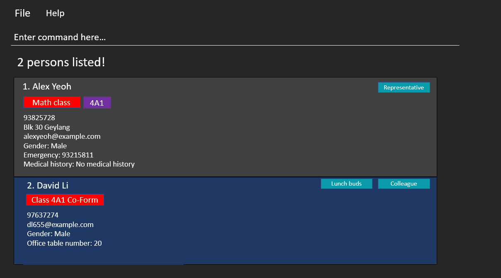

## NewAddressBook - User Guide

NewAddressBook is a **desktop app built for secondary school teachers** handling large classes to help **manage their contacts of their students and colleagues**.

## Features
- [Viewing help](#viewing-help)
- [Adding students](#adding-students)
- [Adding teachers](#adding-teachers)
- [Listing all persons](#listing-all-persons)
- [Finding contacts by name](#finding-contacts-by-name)
- [Deleting a person](#deleting-a-person)
- [Clearing all entries](#clearing-all-entries)
- [Filter students by other fields](#filter-students-by-other-fields)
- [Copying fields](#copying-fields)
- [Adding grades to students](#adding-grades-to-students)
- [Exiting the program](#exiting-the-program)

--------------------------------------------------------------------------------------------------------------------

## Quick start

1. Ensure you have Java `11` or above installed in your Computer.

1. Download the latest `NewAddressBook.jar` from [here](https://github.com/se-edu/addressbook-level3/releases).

1. Copy the file to the folder you want to use as the _home folder_ for your NewAddressBook.

1. Double-click the file to start the app. The GUI similar to the below should appear in a few seconds. Note how the app contains some sample data. 
   

1. Type the command in the command box and press Enter to execute it. e.g. typing **`help`** and pressing Enter will open the help window. 
   Some example commands you can try:

   * **`list`** : Lists all contacts.

   * **`student`**`
     student n/John Doe p/98765432 e/johnd@example.com g/M a/311, Clementi Ave 2, #02-25 f/3E1 em/999 i/Math class t/naughty ` : Adds a student named `John Doe` to NewAddressBook.

   * **`delete`**`3` : Deletes the 3rd contact shown in the current list.

   * **`clear`** : Deletes all contacts.

   * **`exit`** : Exits the app.

1. Refer to the [Features](#features) below for details of each command.

--------------------------------------------------------------------------------------------------------------------

## Features

**:information_source: Notes about the command format:** 

* Words in `UPPER_CASE` are the parameters to be supplied by the user. 
  e.g. in `add n/NAME`, `NAME` is a parameter which can be used as `add n/John Doe`.

* Items in square brackets are optional. 
  e.g `n/NAME [t/TAG]` can be used as `n/John Doe t/friend` or as `n/John Doe`.

* Items with `…`​ after them can be used multiple times including zero times. 
  e.g. `[t/TAG]…​` can be used as ` ` (i.e. 0 times), `t/friend`, `t/friend t/family` etc.

* Parameters can be in any order. 
  e.g. if the command specifies `n/NAME p/PHONE_NUMBER`, `p/PHONE_NUMBER n/NAME` is also acceptable.

* If a parameter is expected only once in the command but you specified it multiple times, only the last occurrence of the parameter will be taken. 
  e.g. if you specify `p/12341234 p/56785678`, only `p/56785678` will be taken.

* Extraneous parameters for commands that do not take in parameters (such as `help`, `list`, `exit` and `clear`) will be ignored. 
  e.g. if the command specifies `help 123`, it will be interpreted as `help`.

### Viewing help : `help`

Shows a message explaning how to access the help page.

Format: `help`

### Adding a student: `student`

Adds a student to NewAddressBook.

Format: `student n/NAME p/PHONE_NUMBER e/EMAIL a/ADDRESS
f/FORM_CLASS g/GENDER i/INVOLVEMENT em/EMERGENCY_NUMBER [m/MEDICAL_HISTORY]…​ [t/TAG]…​`

- `GENDER` can only be one of  the following: M (Male), F (Female) or N (Non-binary)

:bulb: **Tip:**
A student can have any number of tags (including 0)

:bulb: **Tip:**
A student can have any number of medical histories (including 0)

Examples:
- `student n/James p/94629424 e/j77@example.com a/George street, block 123, #01-01 f/3A2 g/M i/Math class em/92696977 m/asthma`
- `student n/Betsy Crowe p/83958294 e/bc33@example.com a/Adams road, block 8, #03-05 f/3C1 g/F i/Dance society em/96122134 t/President t/exco`

### Adding a teacher: `teacher`

Adds a teacher to NewAddressBook.

Format: `teacher n/NAME p/PHONE_NUMBER e/EMAIL a/ADDRESS i/INVOLVEMENT [t/TAG]…​`

:bulb: **Tip:**
A teacher can have any number of tags (including 0), such as whether he/she is a relief teacher.

Examples:
* `teacher n/Gabe p/91234567 e/gabe@example.com g/M o/151 i/Lunch buddy`
* `teacher n/Lebron p/91234567 e/lbj@example.com g/F o/12 i/Math HOD t/relief`

### Adding a medical history to a student: `medical`

Adds a medical history to an existing student in NewAddressBook.

Format: `medical INDEX m/MEDICAL_HISTORY`

:bulb: **Tip:**
Edits the student at the specified index. The index must be a positive integer.
To edit an existing medical history, simply use the same command, which will overwrite 
the current medical history.

Examples:
* `medical 1 m/ADHD`

### Listing all persons : `list`

Shows a list of all persons stored in NewAddressBook.

Format: `list`

### Editing a student : `editStudent`

Edits an existing student in NewAddressBook.

Format: `editStudent INDEX [n/NAME] [p/PHONE] [e/EMAIL] [a/ADDRESS] [t/TAG]…​`

* Edits the student at the specified `INDEX`. The index refers to the index number shown in the displayed person list. The index **must be a positive integer** 1, 2, 3, …​
* At least one of the optional fields must be provided.
* Existing values will be updated to the input values.
* When editing tags, the existing tags of the person will be removed i.e adding of tags is not cumulative.
* You can remove all the person’s tags by typing `t/` without
    specifying any tags after it.

Examples:
*  `editStudent 1 p/91234567 e/johndoe@example.com` Edits the phone number and email address of the 1st person to be `91234567` and `johndoe@example.com` respectively.
*  `editStudent 2 n/Betsy Crower t/` Edits the name of the 2nd person to be `Betsy Crower` and clears all existing tags.

### Locating persons by name: `find`

Finds persons whose names contain any of the given keywords.

Format: `find KEYWORD [MORE_KEYWORDS]`

* The search is case-insensitive. e.g `hans` will match `Hans`
* The order of the keywords does not matter. e.g. `Hans Bo` will match `Bo Hans`
* Only the name is searched.
* Only full words will be matched e.g. `Han` will not match `Hans`
* Persons matching at least one keyword will be returned (i.e. `OR` search).
  e.g. `Hans Bo` will return `Hans Gruber`, `Bo Yang`

Examples:
* `find John` returns `john` and `John Doe`
* `find alex david` returns `Alex Yeoh`, `David Li` 
  

### Deleting a person : `delete`

Deletes the specified person from NewAddressBook.

Format: `delete INDEX`

* Deletes the person at the specified `INDEX`.
* The index refers to the index number shown in the displayed person list.
* The index **must be a positive integer** 1, 2, 3, …​

Examples:
* `list` followed by `delete 2` deletes the 2nd person in the address book.
* `find Betsy` followed by `delete 1` deletes the 1st person in the results of the `find` command.

### Clearing all entries : `clear`

Clears all entries from NewAddressBook.

Format: `clear`

### Filter students/teachers by other fields: `filterStudent` / `filterTeacher`
Filters students/teachers by either:
- tag
- involvement

Format: 
- `filterStudent INVOLVEMENT_FILTER_CATEGORY [t/] [TAG_FILTER CATEGORY]...`
- `filterTeacher INVOLVEMENT_FILTER_CATEGORY [t/] [TAG_FILTER CATEGORY]...`

Filters by involvement first, to filter by tag, add `t/`, followed by tag terms behind

The filter category is not case-sensitive e.g. “student” same as “STUDENT” but "t/" is not the same as "T/"

More than 1 filter is allowed e.g.  `INVOLVEMENT_FILTER_CATERGORY [t/] [TAG_FILTER CATERGORY] [TAG_FILTER CATERGORY]`.

Example: 
- `filterStudent class t/rep` - will return all students with the involvement containing “class” and tag containing 
  “rep”.
- `filterStudent class` - will return all students with the involvement containing “class”.
- `filterTeacher t/colleague admin` - will return all teachers with the tag containing “colleague” and "admin".

### Copying fields
For a filtered sublist of people, copy data based on a certain field to the clipboard. The fields that can be copied are:

- email
- handphone number
- name

Format: `copy f/FIELD`

Example: `copy f/email` - will copy all the email of the filtered sublist of people to the user's clipboard.

### Exiting the program : `exit`

Exits the program.

Format: `exit`

### Adding grades to students
Changes the grades or adds a new grade for the student.

`grades /s STUDENT NAME /u UPDATED GRADES`

The updated grades hould be in a dictionary form, seperated by commas.

Example: `grades /s John Smith /u Biology:A,Chemistry:B,Chinese:C`

Note that one can add an unlimited number of subjects.

If the subject grade is already present, the subject grade will be updated to reflect the new grade specified in the command. Otherwise, a new subject grade will be added.

In the example command above, assume John Smith has the following grades:
- English: D
- Biology: B
- Chinese: D

Then after executing the command, the grades will be updated to
- English: D
- Biology: A
- Chemistry: B
- Chinese: C

### Saving the data

NewAddressBook data are saved in the hard disk automatically after any command that changes the data. There is no need to save manually.

### Editing the data file

NewAddressBook data are saved as a JSON file `[JAR file location]/data/addressbook.json`. Advanced users are welcome to update data directly by editing that data file.

:exclamation: **Caution:**
If your changes to the data file makes its format invalid, NewAddressBook will discard all data and start with an empty data file at the next run.

### Archiving data files `[coming in v2.0]`

_Details coming soon ..._

--------------------------------------------------------------------------------------------------------------------

## FAQ

**Q**: How do I transfer my data to another Computer? 
**A**: Install the app in the other computer and overwrite the empty data file it creates with the file that contains the data of your previous NewAddressBook home folder.

--------------------------------------------------------------------------------------------------------------------

## Command summary

Action | Format, Examples
--------|------------------
**Student** | `student n/NAME p/PHONE_NUMBER e/EMAIL a/ADDRESS f/FORM_CLASS g/GENDER i/INVOLVEMENT em/EMERGENCY_NUMBER [m/MEDICAL_HISTORY]…​ [t/TAG]…​`   e.g., `student n/James p/94629424 e/j77@example.com a/George street, block 123, #01-01 f/3A2 g/M i/Math class em/92696977 m/asthma t/representative`
**Teacher** | `teacher n/NAME p/PHONE_NUMBER e/EMAIL g/GENDER o/OFFICE_TABLE_NUMBER i/INVOLVEMENT [t/TAG]…​`   e.g., `teacher n/Gabe p/91234567 e/gabe@example.com g/M o/151 i/Lunch buddy`
**Clear** | `clear`
**Delete** | `delete INDEX`  e.g., `delete 3`
**Edit** | `edit<Teacher/Student> INDEX [n/NAME] [p/PHONE_NUMBER] [e/EMAIL] [a/ADDRESS] [t/TAG]…​`  e.g.,`editStudent 2 n/James Lee e/jameslee@example.com`
**Find** | `find KEYWORD [MORE_KEYWORDS]`  e.g., `find James Jake`
**Copy** | `copy f/FIELD`   e.g., `copy f/email`
**List** | `list`
**Help** | `help`
