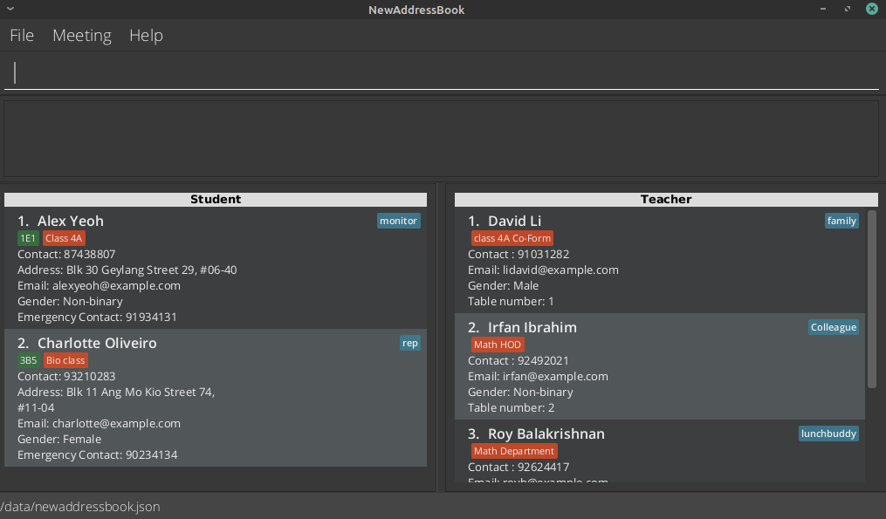
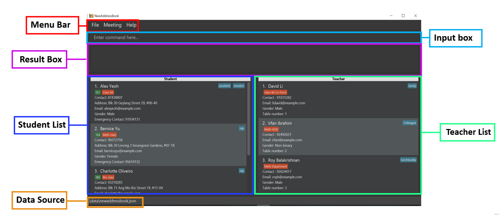
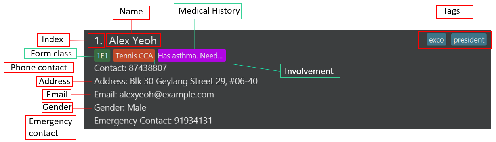
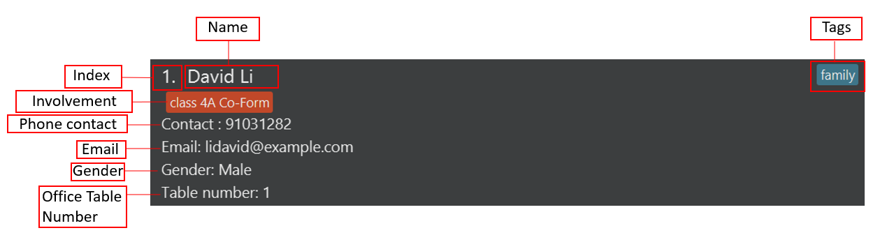
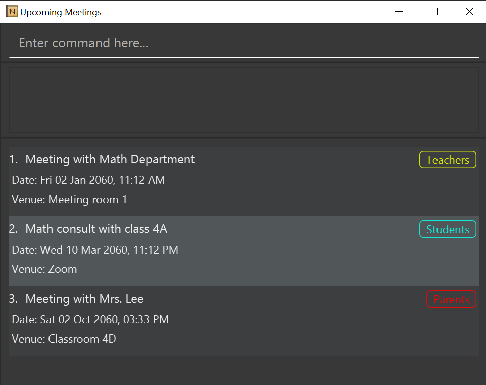
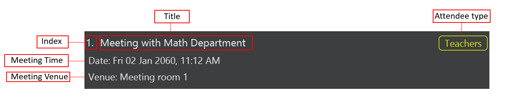
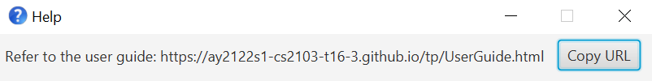

## Introduction

NewAddressBook is a **desktop app built for secondary school teachers** that are handling large classes. It helps them **manage the contacts of their students and colleagues** efficiently. It also supports **keeping track of upcoming meetings** and **recording the medical histories** of students.

* Table of Contents
{:toc}

---------------------------------------------------------------------------------------------------------------
## Quick start

1. Ensure you have Java `11` or above installed in your Computer.

2. Download the latest `NewAddressBook.jar` from [here](https://github.com/AY2122S1-CS2103-T16-3/tp/releases).

3. Copy the file to the folder you want to use as the _home folder_ for NewAddressBook.

4. Double-click the file to start the app. The GUI similar to the below should appear in a few seconds. Note how NewAddressBook already contains some sample data. 
 
   

5. Type a command in the command box and press Enter to execute it. e.g. typing **`help`** and pressing Enter will open the help window. 
   Some example commands you can try:

    * **`listStudent`** : Lists all students.

    * **`student n/John Doe p/98765432 e/johnd@example.com g/M a/311, 
         Clementi Ave 2, #02-25 f/3E1 em/999 i/Math class t/naughty`** : Adds a student named "John Doe" to NewAddressBook.

    * **`deleteStudent 3`** : Deletes the 3rd student shown in the student list.

    * **`clearStudent`** : Deletes all displayed students.

    * **`exit`** : Exits the app.

6. Refer to the [Overview](#overview) section for a summary of commands available and the  [Features](#features) section for details of each command.

:bulb: **Tip:** If you face any issues launching NewAddressBook, go to the `data` folder, delete `newaddressbook.json`
and try launching again.

--------------------------------------------------------------------------------------------------------------------

## Overview

### User Interface (UI)
The following shows the different parts of NewAddressBook's main application window:

* The **Command Box** is where the user types in commands for execution.
* The **Result Box** displays the result of the commands executed. 
* The **Student List** displays the list of students stored in the app.
* The **Teacher List** displays the list of teachers stored in the app.
* The **Data Source** displays information about where the app saves data.

#### Individual Student Display
The following image shows the various aspects that describes a student:

:information_source: The **Medical History** field will only appear if you have added medical history for that student. 
Otherwise, it will not be shown. This allows the user to easily observe whether a student has any medical history.

#### Individual Teacher Display
The following image shows the various aspects that describes a teacher:

#### Meeting Window

Meetings are not displayed in the main window. Instead, they are displayed in a separate window, called the **Meeting window**.

The meeting window pops up when the user enters the `showMeeting` command in the main window's input box. Alternatively, the user may opt to click on the `Show Meetings` button in the menu bar.

The following image shows the meeting window:

The meeting window has its own input box, result box, and a list displaying all meetings.

#### Individual Meeting Display

The various fields that describes a meeting are as follows:

### Commands Summary

:information_source: 
Out of all the commands, the only command which executes in both windows is the `undo` command. The remainding commands work **either** in the main application window or the meeting window, but not both. The `window` column of the table below indicates which window the command is compatible with.

Action | Format | Window
--------|---------|----------
**Add student** | `student n/NAME p/PHONE_NUMBER e/EMAIL a/ADDRESS f/FORM_CLASS g/GENDER i/INVOLVEMENT em/EMERGENCY_NUMBER [t/TAG]…​` | Main
**Clear students** | `clearStudent` | Main
**Copy a field from students** | `copyStudent [c/FIELD_TO_COPY]` | Main
**Delete a student** | `deleteStudent INDEX` | Main
**Edit a student** | `editStudent INDEX [n/NAME] [p/PHONE_NUMBER] [e/EMAIL] [a/ADDRESS] [f/FORM_CLASS] [g/GENDER] [i/INVOLVEMENT] [em/EMERGENCY_NUMBER] [t/TAG]…​` | Main
**Find a student by name** | `findStudent KEYWORD [MORE_KEYWORDS]` | Main
**Filter a student** | `filterStudent [INVOLVEMENT] [t/TAG]…​` | Main
**List all students** |`listStudent` | Main
**Record a student's medical history** | `medical INDEX m/MEDICAL_HISTORY` | Main
**Add teacher** | `teacher n/NAME p/PHONE_NUMBER e/EMAIL g/GENDER o/OFFICE_TABLE_NUMBER i/INVOLVEMENT [t/TAG]…​` | Main
**Copy a field from teachers** | `copyTeacher c/FIELD_TO_COPY` | Main
**Clear teachers** | `clearTeacher` | Main
**Delete a teacher** | `deleteTeacher INDEX` | Main
**Edit a teacher** | `editTeacher INDEX [n/NAME] [p/PHONE_NUMBER] [e/EMAIL] [g/GENDER] [o/OFFICE_TABLE_NUMBER] [i/INVOLVEMENT] [t/TAG]…​` | Main
**Find a teacher by name** | `findTeacher KEYWORD [MORE_KEYWORDS]` | Main
**Filter a teacher** |`filterTeacher [INVOLVEMENT] [t/TAG]…​` | Main
**List all teachers** | `listTeacher` | Main
**Exit** | `exit` | Main
**View help** | `help` | Main
**Open meetings window** | `showMeeting` | Main
**Add meeting** | `meet r/TITLE d/DATE_TIME v/VENUE w/ATTENDEE_TYPE` | Meetings
**Remove meeting** | `deleteMeeting INDEX` | Meetings
**Clear all meetings** | `clearMeeting`  | Meetings
**Close meetings window** | `quitMeeting` | Meetings
**Undo**| `undo` | Both

--------------------------------------------------------------------------------------------------------------------

## Glossary 
* **Involvement**: refers to how the user is involved with the student. This is broad term describing why the user would even want to bother storing the student in the address book in the first place. For example, a form teacher might store the involvement of a student in his class as `in my math class`. A CCA teacher might store the involvement of a student in his badminton CCA as `badminton`. A teacher involved in an overseas CIP trip might want to store the involvement of students going along with him as `CIP trip`.
## Features

**:information_source: Notes about the command format:** 

* Words in `UPPER_CASE` are the parameters to be supplied by the user. 
  e.g. in `addStudent` command, `NAME` under `n/NAME` represents the student's name that you should provide. 
  For instance, if the student's name is "John Doe", then you should input `n/John Doe` in the `addStudent` command.

* Items in square brackets are optional. 
  e.g `n/NAME [t/TAG]` can be used as `n/John Doe t/friend` or as `n/John Doe`.

* Items with `…`​ after them can be used multiple times including zero times. 
  e.g. `[t/TAG]…​` can be used as ` ` (i.e. 0 times), `t/friend`, `t/friend t/family` etc.

* Parameters can be in any order. 
  e.g. if the command specifies `n/NAME p/PHONE_NUMBER`, `p/PHONE_NUMBER n/NAME` is also acceptable.

* If a parameter is expected only once in the command but you specified it multiple times, only the last occurrence of the parameter will be taken. 
  e.g. if you specify `p/12341234 p/56785678`, only `p/56785678` will be taken.

* Extraneous parameters for commands that do not take in parameters (such as `help`, `list`, `exit` and `clear`) will be ignored. 
  e.g. for the `help` command, if you specify `help 123`, it will be interpreted as `help`.

The commands offered can be roughly split into 4 catergories: those involving students, teachers, meetings, and general commands. 

1. [Managing Student Contacts](#managing-student-contacts)
  - [Add a student](#add-a-student--student)
  - [Clear student contacts](#clear-student-contacts--clearstudent)
  - [Copying fields from students](#copying-fields-from-students--copystudent)
  - [Delete a student](#delete-a-student--deletestudent)
  - [Edit a student](#edit-a-student--editstudent)
  - [Find students by name](#find-students-by-name--findstudent)
  - [Filter students](#filter-students--filterstudent)
  - [List all students](#list-all-students--liststudent)
  - [Modify medical history of a student](#modify-medical-history-of-a-student--medical)
  - [View the full medical history of a student](#viewing-the-full-medical-history-of-a-student--showmedical)

2. [Managing Teacher Contacts](#managing-student-contacts)
  - [Add a teacher](#add-a-teacher--teacher)
  - [Clear teacher contacts](#clear-teacher-contacts--clearteacher)
  - [Copying fields from teachers](#copying-fields-from-teachers--copyteacher)
  - [Delete a teacher](#delete-a-teacher--deleteteacher)
  - [Edit a teacher](#edit-a-teacher--editteacher)
  - [Find teachers by name](#find-teachers-by-name--findteacher)
  - [Filter teachers](#filter-teachers--filterteacher)
  - [List all teachers](#list-all-teachers--listteacher)

3. [Managing Meetings](#managing-meetings)
  - [Add a meeting](#add-a-meeting--meet)
  - [Delete a meeting](#delete-a-meeting--deletemeeting)
  - [Clear all meetings](#clear-meetings--clearmeeting)
  - [Show meetings window](#show-meetings-window--showmeeting) 
  - [Quit meetings window](#quit-meetings-window--quitmeeting)
  
4. [General](#general)
 - [Exiting the program](#exiting-the-program--exit)
 - [Undo the latest change](#undo-the-latest-change--undo)
 - [Viewing help](#viewing-help--help)

### Managing Student Contacts

#### Add a student : `student`

Adds a student to the address book.

Format: `student n/NAME p/PHONE_NUMBER e/EMAIL a/ADDRESS
f/FORM_CLASS g/GENDER i/INVOLVEMENT em/EMERGENCY_NUMBER [t/TAG]…​`

Parameters:
* `NAME` The name of the student
  * should not be blank
  * should only contain alphanumeric characters and spaces

* `PHONE_NUMBER` The phone number of the student
  * should only contain numbers, and it should be at least 3 digits long 

* `EMAIL` The email of the student
  * should not be blank 
  * should be of the format `local-part@domain`
  * `local-part` should only contain alphanumeric characters and these special characters, excluding the parentheses, (+_.-)
  * `domain` should be at least 2 characters long, start and end with alphanumeric characters, and only contain alphanumeric characters, periods and hyphens

* `ADDRESS` The address of the student
  * should not be blank
 
* `GENDER` The gender of the student
  * can only be one of  the following: `M` (Male), `F` (Female) or `N` (Non-binary)
  * case-insensitive
  
* `INVOLVEMENT` The user's main involvement with the student
  * should not be blank
  
* `EMERGENCY_NUMBER` The emergency contact number of the student
  * should only contain numbers, and it should be at least 3 digits long

* `FORM_CLASS` The form class that the student belongs to
    * should not be blank
    * should be of the format `|LEVEL|STRING|[ALPHANUMERIC]|`
    * `LEVEL` must be a digit from 1 to 5
    * `STRING` should not be blank and can only contain alphabets
    * `ALPHANUMERIC` is optional and can only contain alphanumeric characters
    * For example, `4E1` is allowed but `41` is not allowed

* `TAG` A tag associated with the student
  * should only contain alphanumeric characters  

:bulb: **Tip:**
A student can have any number of tags (including 0).

:bulb: **Tip:**
Check out how `involvement` is intended to be used in the glossary.

:bulb: **Tip:**
The app prevents the user from adding in duplicate students. Two students are duplicate if they have the same name and address.

Examples:
- `student n/James p/94629424 e/j77@example.com a/George street, block 123, #01-01 f/3A2 g/M i/Math class em/92696977`
- `student n/Betsy Crowe p/83958294 e/bc33@example.com a/Adams road, block 8, #03-05 f/3C1 g/F i/Bio rep em/96122134 t/President t/exco`

#### Clear student contacts : `clearStudent`

Clears all **currently displayed** students from the address book. If the currently displayed list is empty, the application warns the user that the list is empty and nothing is cleared.

Format: `clearStudent`

:bulb: **Tip:**
If you want to delete all students from the address book, simply make sure the currently displayed list contains all students. You can make all students appear in the displayed list by the `listStudent` command. 

#### Copying fields from students : `copyStudent` 
Copy specified data from all **currently displayed** students. The fields that can be copied are:

- email
- phone numbers
- name

Format: `copyStudent [c/FIELD_TO_COPY]`

* `FIELD_TO_COPY` can only be one of the three: `phone`, `email` or `name`.

Example:
* `listStudent` followed by `copyStudent c/email` copies the emails of all students to the user's clipboard.
* `findStudent Betsy` followed by `copyStudent c/phone` copies the phones of students whose name matches Betsy. The definition of "matches" here uses the definition in the `findStudent` command.

:bulb: **Tip:**
If the last shown student list to the user is empty, nothing will be copied to the clipboard.

#### Delete a student : `deleteStudent`

Deletes the specified student from NewAddressBook.

Format: `deleteStudent INDEX`

* Deletes the student at the specified `INDEX`.
* `INDEX` refers to the index number shown in the displayed student list.
* The index **must be a positive integer** 1, 2, 3, …​ not exceeding the size of the displayed student list.

Examples:
* `listStudent` followed by `deleteStudent 2` deletes the 2nd student in the address book.
* `findStudent Betsy` followed by `deleteStudent 1` deletes the 1st student in the results of the `findStudent` command.

#### Edit a student : `editStudent`

Edits an existing student in NewAddressBook.

Format: `editStudent [n/NAME] [p/PHONE_NUMBER] [e/EMAIL] [a/ADDRESS]
[f/FORM_CLASS] [g/GENDER] [i/INVOLVEMENT] [em/EMERGENCY_NUMBER] [t/TAG]…​`

* Edits the student at the specified `INDEX`. 
* `INDEX` refers to the index number shown in the displayed student list. The index **must be a positive integer** 1, 2, 3, …​ not exceeding the size of the displayed student list.
* At least one of the optional fields must be provided.
* Existing values will be updated to the input values.
* When editing tags, the existing tags of the student will be removed i.e adding of tags is not cumulative.

:bulb: **Tip:**
You can remove all the student’s tags by typing `t/` without specifying any tags after it.

:bulb: **Tip:**
If editing the student causes the address book to have duplicate students, the user will not be allowed to edit the student.

Examples:
*  `editStudent 1 f/4Donkey e/johndoe@example.com` Edits the form class and email address of the 1st student to be `4Donkey` and `johndoe@example.com` respectively.
*  `editStudent 2 em/901941341` Edits the emergency contact number of the 2nd student to be 901941341.

#### Find students by name : `findStudent`

Finds students whose names contain any of the given keywords.

Format: `findStudent KEYWORD [MORE_KEYWORDS]`

* The search is case-insensitive. e.g `hans` will match `Hans`
* The order of the keywords does not matter. e.g. `Hans Bo` will match `Bo Hans`
* Only the name is searched.
* Only full words will be matched e.g. `Han` will not match `Hans`
* Students matching **at least one keyword** will be returned (i.e. `OR` search).
  e.g. `Hans Bo` will return `Hans Gruber`, `Bo Yang`

Examples:
* `findStudent John` returns `john` and `John Doe`
* `findStudent alex Yu` returns `Alex Yeoh`, `Bernice Yu`

#### Filter students : `filterStudent`

Filter students by their various fields. The user can filter students by:
- tag
- involvement

:bulb: **Tip:**
The `filterStudent` command differs from the `findStudent` in that `findStudent` only finds students by **name**, where as the `filterStudent` command allows the user to filter out students based on **tags and involvement**.

Format:
- `filterStudent [INVOLVEMENT] [t/TAG]…​`

* It allows filtering by either `tag` or `involvement` or both
* Either `involvement` or `tag` must be present.
* The search for both tag and involvement is case-insensitive. e.g `hans` will match `Hans`
* The search is for both tag and involvement matches substrings, e.g `han` will match `Hans`
* Involvement searches are broken up. That is, if the command was `filterStudent One Two`, `One Two` be broken up into two strings `One` and `Two` and it will search for involvement that contains both `One` and `Two`.
* Students matching **all** of the search will be returned (i.e. `AND` search). For example, if the search was `filterStudent chess club t/member`, only students whose involvement is `chess club` **and** has tags containing `member` will be returned.
* Only alphanumeric tag parameters in the search are allowed.
* Involvement must come before Tag. e.g. `filterStudent chess club t/member` is allowed but `filterStudent t/member chess club` is not

Examples:
- `filterStudent class t/rep` - will return all students with the involvement containing `class` and tag containing `rep`.
- `filterStudent math class` - will return all students with the involvement containing `math class`.
- `filterStudent t/banana t/phone` - will return all students with tags containing “banana” and "phone".

#### List all students : `listStudent`

Shows a list of all students stored in the address book.

Format: `listStudent`

#### Modify medical history of a student : `medical`
Format: `medical INDEX [m/MEDICAL_HISTORY]`

* Adds the medical history to the student at the specified `INDEX`.
* `INDEX` refers to the index number shown in the displayed student list.
* The index **must be a positive integer** 1, 2, 3, …​ not exceeding the size of the displayed student list.

How this command works:
1. Adds a medical history to the existing student if he does not have any existing medical history.
2. Overwrites the medical history of the student if the he already has an existing medical history.
3. Removes the medical history of a studen if the student already has an existing medical history and an empty `MEDICAL_HISTORY` is given.

Examples:
* `medical 1 m/ADHD` 

#### View the full medical history of a student : `showMedical`

Displays a pop-up window for the user to view the full medical history of the student in NewAddressBook.

Format: `showMedical INDEX`

* View the full medical history of the student at the specified `INDEX`.
* `INDEX` refers to the index number shown in the displayed student list.
* The index **must be a positive integer** 1, 2, 3, …​ not exceeding the size of the displayed student list.

Examples:
* `showMedical 1`

### Managing Teacher Contacts

#### Add a teacher : `teacher`

Adds a teacher to NewAddressBook.

Format: `teacher n/NAME p/PHONE_NUMBER e/EMAIL g/GENDER o/OFFICE_TABLE_NUMBER 
i/INVOLVEMENT [t/TAG]…​`

Parameters:
* `NAME` The name of the teacher
    * should not be blank
    * should only contain alphanumeric characters and spaces

* `PHONE_NUMBER` The phone number of the teacher
    * should only contain numbers, and it should be at least 3 digits long

* `EMAIL` The email of the teacher
    * should not be blank
    * should be of the format `local-part@domain`
    * `local-part` should only contain alphanumeric characters and these special characters, excluding the parentheses, (+_.-)
    * `domain` should be at least 2 characters long, start and end with alphanumeric characters, and only contain alphanumeric characters, periods and hyphens

* `GENDER` The gender of the teacher
    * can only be one of  the following: `M` (Male), `F` (Female) or `N` (Non-binary)
    * case-insensitive

* `OFFICE_TABLE_NUMBER` The teacher's table number in the school office
  * should only contain numbers. It should have at least 1 digit and at most 5 digits

* `INVOLVEMENT` The user's involvement with the teacher
    * should not be blank

* `TAG` A tag associated with the teacher
    * should only contain alphanumeric characters

:bulb: **Tip:**
A teacher can have any number of tags (including 0).

:bulb: **Tip:**
Check out how `involvement` is intended to be used in the glossary.

:bulb: **Tip:**
The app prevents the user from adding in duplicate teachers. Two teachers the same if they have the same name and office table number.

Examples:
- `teacher n/Messi p/94629424 e/j77@example.com o/12 g/M i/Math Department`
- `teacher n/Eden p/83958294 e/bc33@example.com o/15 g/N i/Class 3D Co-form t/buddy t/colleague`

#### Clear teacher contacts : `clearTeacher`

Clears all **currently displayed** teachers from the address book. If the currently displayed list is empty, the application warns the user that the list is empty and nothing is cleared.

Format: `clearTeacher`

:bulb: **Tip:**
If you want to delete all teachers from the address book, simply make sure the currently displayed list contains all teachers. You can make all teachers appear in the displayed list by the `listTeacher` command. 

#### Copying fields from teachers : `copyTeacher`
Copy specified data from all **currently displayed** teachers. The fields that can be copied are:

- email
- phone numbers
- name

Format: `copyTeacher [c/FIELD_TO_COPY]`

`FIELD_TO_COPY` can only be one of three strings: `phone`, `email` or `name`.

Example:
* `listTeacher` followed by `copyTeacher c/email` copies the emails of all teachers to the user's clipboard.
* `findTeacher Betsy` followed by `copyTeacher c/phone` copies the phones of teachers whose name matches Betsy. The definition of "matches" is as per the definition in the `findTeacher` command.

:bulb: **Tip:**
If the last shown teacher list to the user is empty, nothing will be copied to the clipboard.

#### Delete a teacher : `deleteTeacher`

Deletes the specified teacher from NewAddressBook.

Format: `deleteTeacher INDEX`

* Deletes the teacher at the specified `INDEX`.
* `INDEX` refers to the index number shown in the displayed teacher list.
* The index **must be a positive integer** 1, 2, 3, …​ not exceeding the size of the displayed teacher list.

Examples:
* `listTeacher` followed by `deleteTeacher 2` deletes the 2nd teacher in the address book.
* `findTeacher Betsy` followed by `deleteTeacher 1` deletes the 1st teacher in the results of the `findTeacher` command.

#### Edit a teacher : `editTeacher`

Edits an existing teacher in the address book.

Format: `editTeacher [n/NAME] [p/PHONE_NUMBER] [e/EMAIL] [g/GENDER] [o/OFFICE_TABLE_NUMBER] [i/INVOLVEMENT] [t/TAG]…​`

* Edits the teacher at the specified `INDEX`.
* `INDEX` refers to the index number shown in the displayed teacher list. The index **must be a positive integer** 1, 2, 3, …​ not exceeding the size of the displayed student list.
* At least one of the optional fields must be provided.
* Existing values will be updated to the input values.
* When editing tags, the existing tags of the teacher will be removed i.e adding of tags is not cumulative.

:bulb: **Tip:**
You can remove all the teacher’s tags by typing `t/` without specifying any tags after it.

:bulb: **Tip:**
If editing the teacher causes the address book to have duplicate teachers, the user will not be allowed to edit the teacher.

Examples:
*  `editTeacher 1 p/91234567 e/johndoe@example.com` Edits the phone number and email address of the 1st teacher to be `91234567` and `johndoe@example.com` respectively.
*  `editTeacher 2 o/5 t/` Edits the office table number of the 2nd teacher to be 5 and clears all existing tags.

#### Find teachers by name : `findTeacher`

Finds teachers whose names contain any of the given keywords.

Format: `findTeacher KEYWORD [MORE_KEYWORDS]`

* The search is case-insensitive. e.g `hans` will match `Hans`
* The order of the keywords does not matter. e.g. `Hans Bo` will match `Bo Hans`
* Only the name is searched.
* Only full words will be matched e.g. `Han` will not match `Hans`
* Teachers matching at least one keyword will be returned (i.e. `OR` search).
  e.g. `Hans Bo` will return `Hans Gruber`, `Bo Yang`

Examples:
* `findTeacher John` returns `john` and `John Doe`
* `findTeacher alex Yu` returns `Alex Yeoh`, `Bernice Yu`

#### Filter teachers : `filterTeacher`
Filter teachers by their various fields. The user can filter teachers by:
- tag
- involvement

:bulb: **Tip:**
The `filterTeacher` command differs from the `findStudent` in that `findStudent` only finds teachers by **name**, where as the `filterTeacher` command allows the user to filter out teachers based on **tags and involvement**.

Format:
- `filterTeacher [INVOLVEMENT] [t/TAG]…​`

* It allows filtering by either `tag` or `involvement` or both
* Either `involvement` or `tag` must be present.
* The search for both tag and involvement is case-insensitive. e.g `hans` will match `Hans`
* The search is for both tag and involvement matches substrings, e.g `han` will match `Hans`
* Involvement searches are broken up. That is, if the command was `filterTeacher One Two`, `One Two` be broken up into two strings `One` and `Two` and it will search for involvement that contains both `One` and `Two`.
* Teachers matching **all** of the search will be returned (i.e. `AND` search). For example, if the search was `filterTeacher chess club t/coordinator`, only teachers whose involvement is `chess club` **and** has tags containing `coordinator` will be returned.
* Only alphanumeric tag parameters in the search are allowed.
* Involvement must come before Tag. e.g. `filterTeacher chess club t/coordinator` is allowed but `filterTeacher t/coordinator chess club` is not

Example:
- `filterTeacher class t/rep` - will return all teachers with the involvement containing `class` and tag containing `rep`.
- `filterTeacher math class` - will return all teachers with the involvement containing `math class`.
- `filterTeacher t/banana t/phone` - will return all teachers with tags containing `banana` and `phone`.

#### List all teachers : `listTeacher`

Shows a list of all teachers stored in NewAddressBook.

Format: `listTeacher`

### Managing Meetings

NewAddressBook also allows you to keep track of upcoming meetings with parents, teachers or students.

:bulb: **Tip:**
NewAddressBook automatically removes meetings that have expired, so the user does not have to worry about deleting them!

#### Add a meeting : `meet`

Format: `meet r/TITLE d/DATE_TIME v/VENUE w/ATTENDEE_TYPE`

Parameters:
* `TITLE` A brief summary of the meeting. 
* `DATE_TIME` A valid date and time of the meeting. 
  * should be of the format `YYYY-MM-DD HH:mm`
* `VENUE`: The venue of the meeting.
* `ATTENDEE_TYPE`: The type of person(s) you are meeting with.
  * can only be one of the following: `S` (students), `T` (teachers), `P` (parents)

:bulb: **Tip:**
You cannot add meetings in the past.

:bulb: **Tip:**
NewAddressBook will prevent you from adding a meeting if the new meeting clashes (exact same date and time) with an existing meeting.

:bulb: **Tip:**
If you provide an invalid date, the error message given by NewAddressBook is the same as when you provide an invalid datetime format.
For example, "2022-02-29" is an invalid date since 2022 is not a leap year.

Example:
* `meet r/Meeting with Ms.Lee d/2040-07-12 14:08 v/Seminar room 3 w/P`

#### Delete a meeting : `deleteMeeting`

Deletes the specified meeting from NewAddressBook.

Format: `deleteMeeting INDEX`

* Deletes the meeting at the specified `INDEX`.
* `INDEX` refers to the index number shown in the displayed meeting list.
* The index **must be a positive integer** 1, 2, 3, …​ not exceeding the size of the displayed meeting list.

Examples:
* `deleteMeeting 2` deletes the 2nd meeting in the address book.
* `deleteMeeting 0` will return an error since the index is not positive.

#### Clear meetings : `clearMeeting`

Clears all meetings in NewAddressBook.

Format: `clearMeeting`

#### Show meetings window : `showMeeting`

Pops out the meeting window. 

Format: `showMeeting`

#### Quit meetings window : `quitMeeting`

Closes the meeting window.

Format: `quitMeeting`

### General

#### Exiting the program : `exit`

Exits the program.

Format: `exit`

#### Undo the latest change : `undo`

Undoes the last change. This command only works for operations that adds, deletes, or edits infomation. 
This means that commands such as `filterStudent/filterTeacher` and the `copyStudent/copyTeacher` command cannot be undone. One can undo adding/deleting meetings as well.

:bulb: **Tip:** The `undo` command works in both the main and meeting window.

:bulb: **Tip:** `undo` undoes the last action, **no matter** which window one executes it from. For example, if one edited a student in the main window, then added a meeting from the meeting window, executing the `undo` command from the main window will undo the action of **adding the meeting**, rather than the action of editing the student. Another way of putting it is that the `undo` command undoes the user's last action, rather than the user's last action **in that window**.

#### Viewing help : `help`

Shows a message explaining how to access the help page.

Format: `help`

--------------------------------------------------------------------------------------------------------------------

## NewAddressBook Data File

### Saving the data

NewAddressBook data are saved in the hard disk automatically after any command that changes the data. There is no need to save manually.

### Editing the data file

NewAddressBook data are saved as a JSON file `[JAR file location]/data/newaddressbook.json`. Advanced users are welcome to update data directly by editing the data file.

:exclamation: **Caution:**
If your changes to the data file makes its format invalid, NewAddressBook will discard all data and start with an 
empty data file at the next run. In the event that the modification you make causes NewAddressBook to stop functioning 
properly, please manually remove the data file and launch the app again.

--------------------------------------------------------------------------------------------------------------------
## FAQ

**Q**: How do I transfer my data to another Computer? 
**A**: Install the app in the other computer and overwrite the empty data file it creates with the file that contains the data of your previous NewAddressBook home folder.

--------------------------------------------------------------------------------------------------------------------
